# ITSM Agentic Platform

A production-shaped Generative AI system for IT Service Management.

An employee types *"my VPN keeps dropping with error 812"*. Ninety seconds later
one of five things has happened, and you can prove which and why:

1. They got an answer with citations to your actual runbook.
2. A safe automation ran and told them what it did.
3. A ticket was raised, pre-triaged, pre-summarised, routed to the right queue.
4. It was escalated as a major incident because 200 other people just said the same thing.
5. The agent asked one clarifying question instead of guessing.

Everything in between — classification, retrieval, the confidence calculation,
the routing decision, the model spend — is instrumented, checkpointed and
auditable.

---

## Table of contents

| | |
|---|---|
| [1. System context](#1-system-context) | Who talks to what |
| [2. Container architecture](#2-container-architecture) | The nine layers, in code |
| [3. End-to-end user journeys](#3-end-to-end-user-journeys) | Four personas, four flows |
| [4. The chat request lifecycle](#4-the-chat-request-lifecycle) | Every hop, in order |
| [5. The agent graph](#5-the-agent-graph) | Nodes, edges, state machine |
| [6. The routing decision](#6-the-routing-decision) | The one function that matters |
| [7. The retrieval pipeline](#7-the-retrieval-pipeline) | Rewrite → fuse → rerank → compress |
| [8. The ingestion pipeline](#8-the-ingestion-pipeline) | S3 → parse → chunk → embed → index |
| [9. Data model](#9-data-model) | ER diagram and ownership |
| [10. Storage layouts](#10-storage-layouts) | Redis keys, OpenSearch mapping, S3 paths |
| [11. Failure modes](#11-failure-modes) | What breaks and what happens |
| [12. Observability](#12-observability) | Traces, metrics, the trace waterfall |
| [13. Security and governance](#13-security-and-governance) | Trust boundaries, RBAC, responsible AI |
| [14. Deployment topology](#14-deployment-topology) | Local, and what prod looks like |
| [15. Scaling and capacity](#15-scaling-and-capacity) | Real numbers to size against |
| [16. Getting it running](#16-getting-it-running) | Five commands |
| [17. API reference](#17-api-reference) | All 24 endpoints |
| [18. Configuration](#18-configuration) | Every knob |
| [19. Evaluation](#19-evaluation) | The golden set discipline |
| [20. Design decisions](#20-design-decisions-worth-defending) | Why, not what |

Supporting docs: [`docs/architecture.md`](docs/architecture.md) ·
[`docs/sequence-flows.md`](docs/sequence-flows.md) ·
[`docs/data-model.md`](docs/data-model.md) ·
[`docs/operations.md`](docs/operations.md) ·
[`docs/security.md`](docs/security.md)

---

## 1. System context

Who uses it, and what it depends on.

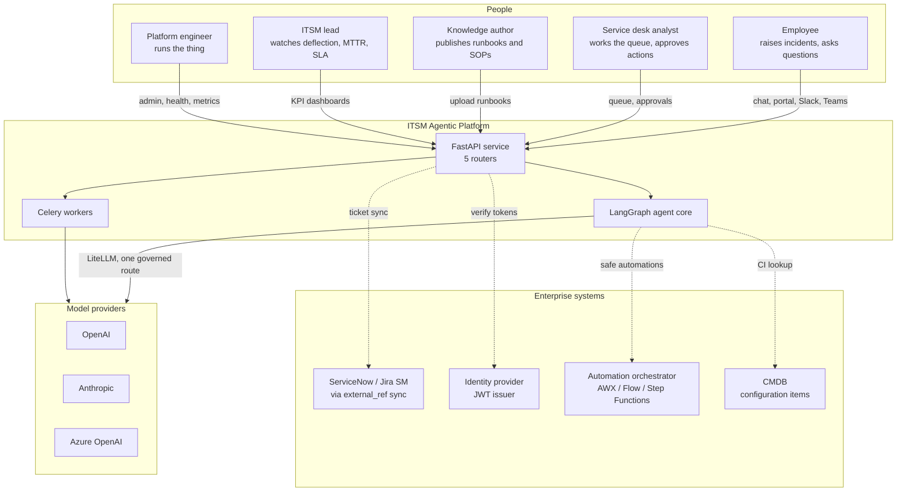
```mermaid
graph TB
    subgraph People
        EMP["Employee<br/>raises incidents, asks questions"]
        ANL["Service desk analyst<br/>works the queue, approves actions"]
        KBA["Knowledge author<br/>publishes runbooks and SOPs"]
        LEAD["ITSM lead<br/>watches deflection, MTTR, SLA"]
        PLAT["Platform engineer<br/>runs the thing"]
    end

    subgraph Platform["ITSM Agentic Platform"]
        API["FastAPI service<br/>5 routers"]
        AGENT["LangGraph agent core"]
        WORK["Celery workers"]
    end

    subgraph Enterprise["Enterprise systems"]
        SNOW["ServiceNow / Jira SM<br/>via external_ref sync"]
        IDP["Identity provider<br/>JWT issuer"]
        ORCH["Automation orchestrator<br/>AWX / Flow / Step Functions"]
        CMDB["CMDB<br/>configuration items"]
    end

    subgraph Providers["Model providers"]
        OAI["OpenAI"]
        ANT["Anthropic"]
        AZ["Azure OpenAI"]
    end

    EMP -->|"chat, portal, Slack, Teams"| API
    ANL -->|"queue, approvals"| API
    KBA -->|"upload runbooks"| API
    LEAD -->|"KPI dashboards"| API
    PLAT -->|"admin, health, metrics"| API

    API --> AGENT
    API --> WORK
    AGENT -->|"LiteLLM, one governed route"| Providers
    WORK --> Providers

    AGENT -.->|"safe automations"| ORCH
    API -.->|"ticket sync"| SNOW
    API -.->|"verify tokens"| IDP
    AGENT -.->|"CI lookup"| CMDB
```

Everything dotted is a seam you wire to your own estate. Everything solid is in
this repo and works out of the box.

---

## 2. Container architecture

The nine layers from the architecture diagram, with the actual modules that
implement them.

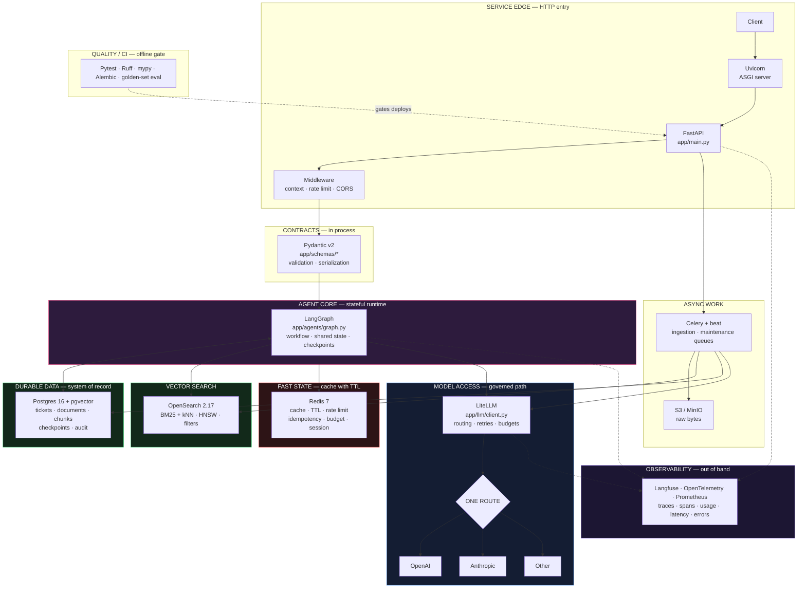
```mermaid
graph TB
    subgraph L1["SERVICE EDGE — HTTP entry"]
        CLI["Client"]
        UVI["Uvicorn<br/>ASGI server"]
        FAPI["FastAPI<br/>app/main.py"]
        MW["Middleware<br/>context · rate limit · CORS"]
    end

    subgraph L2["CONTRACTS — in process"]
        PYD["Pydantic v2<br/>app/schemas/*<br/>validation · serialization"]
    end

    subgraph L3["AGENT CORE — stateful runtime"]
        LG["LangGraph<br/>app/agents/graph.py<br/>workflow · shared state · checkpoints"]
    end

    subgraph L4["DURABLE DATA — system of record"]
        PG["Postgres 16 + pgvector<br/>tickets · documents · chunks<br/>checkpoints · audit"]
    end

    subgraph L5["VECTOR SEARCH"]
        OS["OpenSearch 2.17<br/>BM25 + kNN · HNSW · filters"]
    end

    subgraph L6["FAST STATE — cache with TTL"]
        RD["Redis 7<br/>cache · TTL · rate limit<br/>idempotency · budget · session"]
    end

    subgraph L7["MODEL ACCESS — governed path"]
        LL["LiteLLM<br/>app/llm/client.py<br/>routing · retries · budgets"]
        ROUTE{"ONE ROUTE"}
        P1["OpenAI"]
        P2["Anthropic"]
        P3["Other"]
    end

    subgraph L8["OBSERVABILITY — out of band"]
        OBS["Langfuse · OpenTelemetry · Prometheus<br/>traces · spans · usage · latency · errors"]
    end

    subgraph L9["ASYNC WORK"]
        CEL["Celery + beat<br/>ingestion · maintenance queues"]
        S3["S3 / MinIO<br/>raw bytes"]
    end

    subgraph L10["QUALITY / CI — offline gate"]
        Q["Pytest · Ruff · mypy · Alembic · golden-set eval"]
    end

    CLI --> UVI --> FAPI --> MW --> PYD --> LG
    LG <--> PG
    LG --> OS
    LG --> RD
    LG --> LL --> ROUTE
    ROUTE --> P1 & P2 & P3
    FAPI --> CEL
    CEL --> S3
    CEL --> OS
    CEL --> PG
    CEL --> LL
    LL -.-> OBS
    LG -.-> OBS
    FAPI -.-> OBS
    Q -.->|"gates deploys"| FAPI

    style L3 fill:#2d1b3d,stroke:#e94f8a,color:#fff
    style L4 fill:#12291a,stroke:#4ade80,color:#fff
    style L5 fill:#12291a,stroke:#4ade80,color:#fff
    style L6 fill:#2d1416,stroke:#ef4444,color:#fff
    style L7 fill:#141d33,stroke:#60a5fa,color:#fff
    style L8 fill:#1c1633,stroke:#a78bfa,color:#fff
```

### Module map

```
app/
├── main.py                     app factory · lifespan · router registration
│
├── core/                       ── SERVICE EDGE + cross-cutting
│   ├── config.py               every env var, validated at boot
│   ├── logging.py              structlog JSON + request/trace context vars
│   ├── errors.py               typed errors → one response envelope
│   ├── security.py             Principal, JWT + API key, RBAC
│   ├── middleware.py           request id · timing · metrics · rate limit
│   └── observability.py        OTel provider · Prometheus · Langfuse wiring
│
├── schemas/                    ── CONTRACTS
│   ├── common.py               Page, Citation, Usage, ErrorEnvelope
│   ├── chat.py  ingestion.py  ticket.py  knowledge.py
│
├── agents/                     ── AGENT CORE
│   ├── state.py                ITSMState — the typed contract between nodes
│   ├── graph.py                nodes, edges, _decide()
│   ├── checkpointer.py         AsyncPostgresSaver + memory fallback
│   ├── nodes/                  guardrails · triage · retrieve · resolve · act
│   └── tools/itsm_tools.py     ticket CRUD · automations · audit
│
├── db/                         ── DURABLE DATA
│   ├── session.py              async engine, request-scoped + worker-scoped
│   └── models.py               9 tables incl. pgvector column
│
├── retrieval/                  ── VECTOR SEARCH
│   ├── opensearch_store.py     index design, BM25, kNN, bulk, delete-by-doc
│   ├── pgvector_store.py       consistent similarity + similar-tickets SQL
│   ├── pipeline.py             rewrite · RRF · rerank · compress
│   ├── chunking.py             heading-aware splitter
│   └── parsers.py              Docling → pypdf → markdownify
│
├── cache/                      ── FAST STATE
│   ├── redis_client.py  rate_limit.py  idempotency.py  budget.py
│
├── llm/                        ── MODEL ACCESS
│   ├── client.py               THE only path to a model
│   └── prompts.py              every prompt, in one reviewable file
│
├── storage/s3.py               ── OBJECT STORE (async for API, sync for workers)
│
├── routers/                    chat · ingestion · tickets · knowledge · admin · health
├── services/                   orchestration between routers and the agent
├── workers/                    ── ASYNC WORK
│   ├── celery_app.py           queues, routing, beat schedule
│   ├── runtime.py              loop-safe async helpers for forked workers
│   └── tasks/                  ingestion.py · maintenance.py
└── evals/                      ── QUALITY GATE
    ├── dataset.py  runner.py  metrics.py
```

---

## 3. End-to-end user journeys

### 3.1 Employee — incident resolved without a ticket

The happy path, and the one your deflection rate depends on.

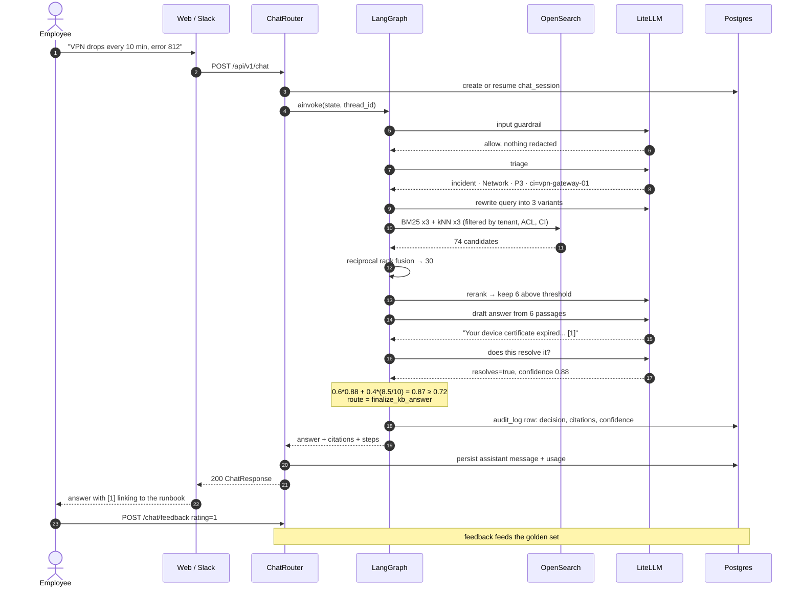
```mermaid
sequenceDiagram
    autonumber
    actor E as Employee
    participant W as Web / Slack
    participant API as ChatRouter
    participant AG as LangGraph
    participant OS as OpenSearch
    participant LLM as LiteLLM
    participant PG as Postgres

    E->>W: "VPN drops every 10 min, error 812"
    W->>API: POST /api/v1/chat
    API->>PG: create or resume chat_session
    API->>AG: ainvoke(state, thread_id)

    AG->>LLM: input guardrail
    LLM-->>AG: allow, nothing redacted
    AG->>LLM: triage
    LLM-->>AG: incident · Network · P3 · ci=vpn-gateway-01

    AG->>LLM: rewrite query into 3 variants
    AG->>OS: BM25 x3 + kNN x3 (filtered by tenant, ACL, CI)
    OS-->>AG: 74 candidates
    AG->>AG: reciprocal rank fusion → 30
    AG->>LLM: rerank → keep 6 above threshold

    AG->>LLM: draft answer from 6 passages
    LLM-->>AG: "Your device certificate expired... [1]"
    AG->>LLM: does this resolve it?
    LLM-->>AG: resolves=true, confidence 0.88

    Note over AG: 0.6*0.88 + 0.4*(8.5/10) = 0.87 ≥ 0.72<br/>route = finalize_kb_answer

    AG->>PG: audit_log row: decision, citations, confidence
    AG-->>API: answer + citations + steps
    API->>PG: persist assistant message + usage
    API-->>W: 200 ChatResponse
    W-->>E: answer with [1] linking to the runbook

    E->>API: POST /chat/feedback rating=1
    Note over API,PG: feedback feeds the golden set
```

**No ticket was created.** That is the point. The event is still fully recorded
in `audit_log` and `chat_messages`, so the deflection is measurable rather than
invisible.

### 3.2 Employee — major incident, auto-escalated

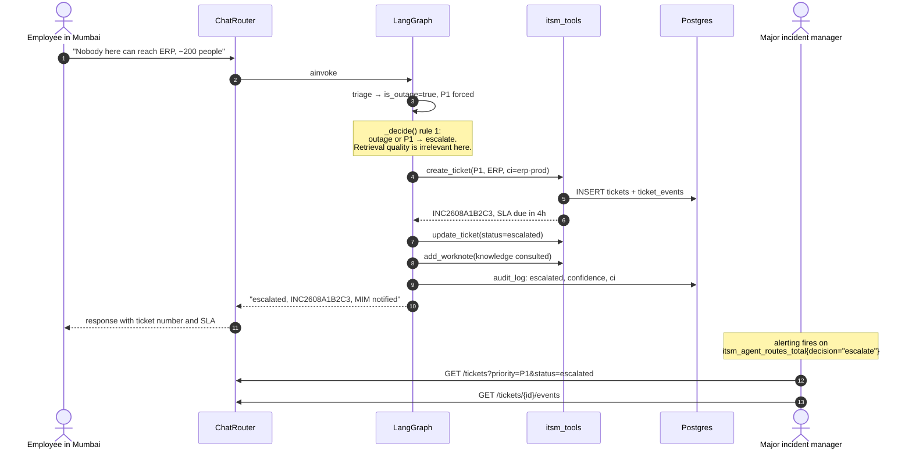
```mermaid
sequenceDiagram
    autonumber
    actor E as Employee in Mumbai
    participant API as ChatRouter
    participant AG as LangGraph
    participant T as itsm_tools
    participant PG as Postgres
    actor MIM as Major incident manager

    E->>API: "Nobody here can reach ERP, ~200 people"
    API->>AG: ainvoke
    AG->>AG: triage → is_outage=true, P1 forced

    Note over AG: _decide() rule 1:<br/>outage or P1 → escalate.<br/>Retrieval quality is irrelevant here.

    AG->>T: create_ticket(P1, ERP, ci=erp-prod)
    T->>PG: INSERT tickets + ticket_events
    T-->>AG: INC2608A1B2C3, SLA due in 4h
    AG->>T: update_ticket(status=escalated)
    AG->>T: add_worknote(knowledge consulted)
    AG->>PG: audit_log: escalated, confidence, ci

    AG-->>API: "escalated, INC2608A1B2C3, MIM notified"
    API-->>E: response with ticket number and SLA

    Note over MIM: alerting fires on<br/>itsm_agent_routes_total{decision="escalate"}
    MIM->>API: GET /tickets?priority=P1&status=escalated
    MIM->>API: GET /tickets/{id}/events
```

Escalation is checked **before** confidence. A confident-sounding KB answer must
never suppress an outage.

### 3.3 Knowledge author — publishing a runbook

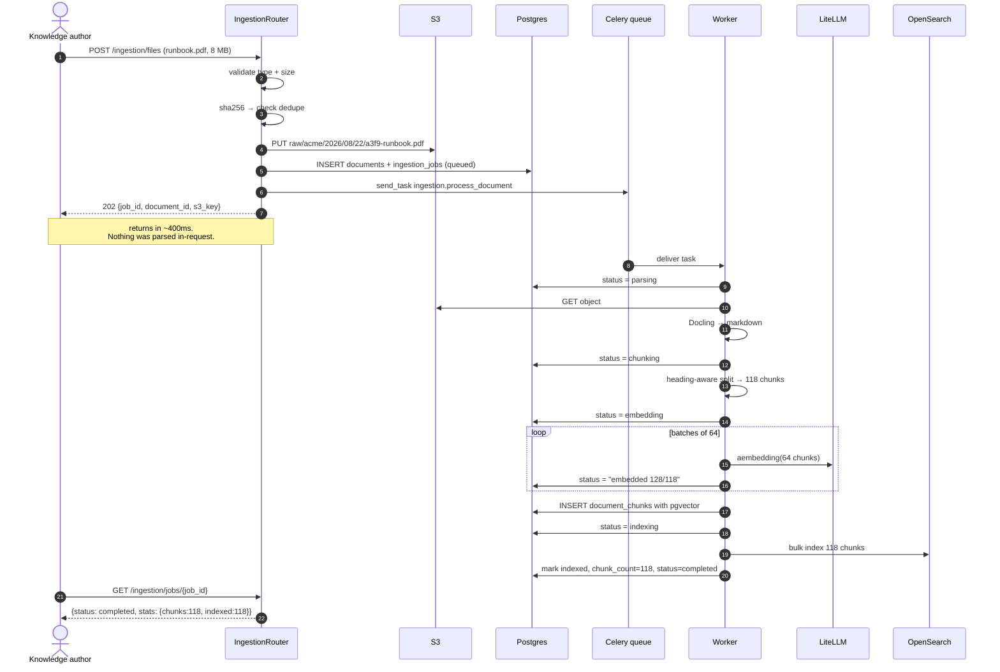
```mermaid
sequenceDiagram
    autonumber
    actor K as Knowledge author
    participant IR as IngestionRouter
    participant S3
    participant PG as Postgres
    participant Q as Celery queue
    participant WK as Worker
    participant LLM as LiteLLM
    participant OS as OpenSearch

    K->>IR: POST /ingestion/files (runbook.pdf, 8 MB)
    IR->>IR: validate type + size
    IR->>IR: sha256 → check dedupe
    IR->>S3: PUT raw/acme/2026/08/22/a3f9-runbook.pdf
    IR->>PG: INSERT documents + ingestion_jobs (queued)
    IR->>Q: send_task ingestion.process_document
    IR-->>K: 202 {job_id, document_id, s3_key}
    Note over K,IR: returns in ~400ms.<br/>Nothing was parsed in-request.

    Q->>WK: deliver task
    WK->>PG: status = parsing
    WK->>S3: GET object
    WK->>WK: Docling → markdown
    WK->>PG: status = chunking
    WK->>WK: heading-aware split → 118 chunks
    WK->>PG: status = embedding
    loop batches of 64
        WK->>LLM: aembedding(64 chunks)
        WK->>PG: status = "embedded 128/118"
    end
    WK->>PG: INSERT document_chunks with pgvector
    WK->>PG: status = indexing
    WK->>OS: bulk index 118 chunks
    WK->>PG: mark indexed, chunk_count=118, status=completed

    K->>IR: GET /ingestion/jobs/{job_id}
    IR-->>K: {status: completed, stats: {chunks:118, indexed:118}}
```

### 3.4 Analyst and ITSM lead — the operational loop

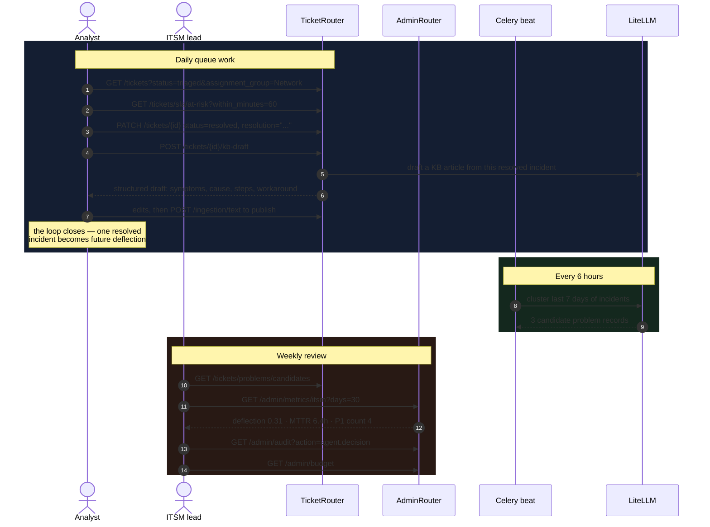
```mermaid
sequenceDiagram
    autonumber
    actor A as Analyst
    actor L as ITSM lead
    participant TR as TicketRouter
    participant AR as AdminRouter
    participant BEAT as Celery beat
    participant LLM as LiteLLM

    rect rgb(20,30,50)
        Note over A,TR: Daily queue work
        A->>TR: GET /tickets?status=triaged&assignment_group=Network
        A->>TR: GET /tickets/sla/at-risk?within_minutes=60
        A->>TR: PATCH /tickets/{id} status=resolved, resolution="..."
        A->>TR: POST /tickets/{id}/kb-draft
        TR->>LLM: draft a KB article from this resolved incident
        TR-->>A: structured draft: symptoms, cause, steps, workaround
        A->>TR: edits, then POST /ingestion/text to publish
        Note over A: the loop closes — one resolved<br/>incident becomes future deflection
    end

    rect rgb(20,40,30)
        Note over BEAT,LLM: Every 6 hours
        BEAT->>LLM: cluster last 7 days of incidents
        LLM-->>BEAT: 3 candidate problem records
    end

    rect rgb(40,25,20)
        Note over L,AR: Weekly review
        L->>TR: GET /tickets/problems/candidates
        L->>AR: GET /admin/metrics/itsm?days=30
        AR-->>L: deflection 0.31 · MTTR 6.4h · P1 count 4
        L->>AR: GET /admin/audit?action=agent.decision
        L->>AR: GET /admin/budget
    end
```

---

## 4. The chat request lifecycle

Every hop for a single `POST /api/v1/chat`, in order, with the module that owns it.

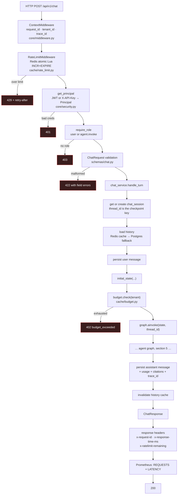
```mermaid
flowchart TD
    A["HTTP POST /api/v1/chat"] --> B["ContextMiddleware<br/>request_id · tenant_id · trace_id<br/>core/middleware.py"]
    B --> C["RateLimitMiddleware<br/>Redis atomic Lua INCR+EXPIRE<br/>cache/rate_limit.py"]
    C -->|"over limit"| C1["429 + retry-after"]
    C --> D["get_principal<br/>JWT or X-API-Key → Principal<br/>core/security.py"]
    D -->|"bad creds"| D1["401"]
    D --> E["require_role<br/>user or agent.invoke"]
    E -->|"no role"| E1["403"]
    E --> F["ChatRequest validation<br/>schemas/chat.py"]
    F -->|"malformed"| F1["422 with field errors"]
    F --> G["chat_service.handle_turn"]

    G --> H["get or create chat_session<br/>thread_id is the checkpoint key"]
    H --> I["load history<br/>Redis cache → Postgres fallback"]
    I --> J["persist user message"]
    J --> K["initial_state(...)"]
    K --> L["budget.check(tenant)<br/>cache/budget.py"]
    L -->|"exhausted"| L1["402 budget_exceeded"]
    L --> M["graph.ainvoke(state, thread_id)"]

    M --> N["… agent graph, section 5 …"]
    N --> O["persist assistant message<br/>+ usage + citations + trace_id"]
    O --> P["invalidate history cache"]
    P --> Q["ChatResponse"]
    Q --> R["response headers<br/>x-request-id · x-response-time-ms<br/>x-ratelimit-remaining"]
    R --> S["Prometheus: REQUESTS + LATENCY"]
    S --> T["200"]

    style C1 fill:#3b1d1d,stroke:#ef4444,color:#fff
    style D1 fill:#3b1d1d,stroke:#ef4444,color:#fff
    style E1 fill:#3b1d1d,stroke:#ef4444,color:#fff
    style F1 fill:#3b1d1d,stroke:#ef4444,color:#fff
    style L1 fill:#3b1d1d,stroke:#ef4444,color:#fff
```

### The streaming variant

`POST /chat/stream` returns SSE. It streams **graph events, not tokens** —
because for a service desk the useful signal is *"searching the knowledge base"*,
*"raising a ticket"*, not a token trickle.

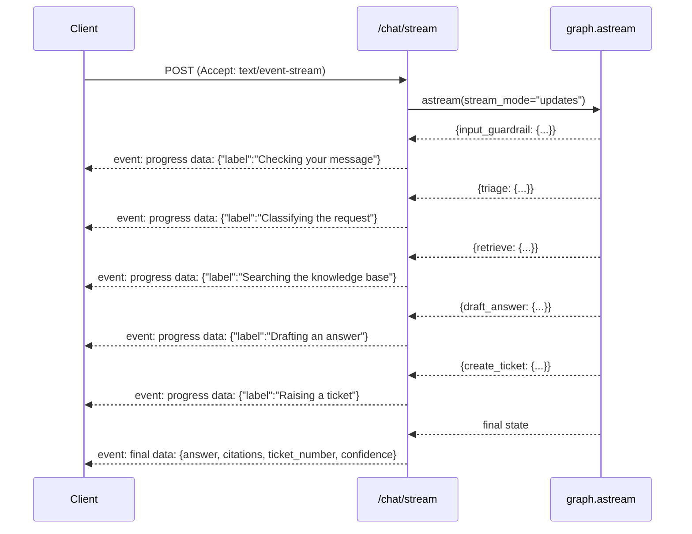
```mermaid
sequenceDiagram
    participant C as Client
    participant API as /chat/stream
    participant AG as graph.astream

    C->>API: POST (Accept: text/event-stream)
    API->>AG: astream(stream_mode="updates")
    AG-->>API: {input_guardrail: {...}}
    API-->>C: event: progress  data: {"label":"Checking your message"}
    AG-->>API: {triage: {...}}
    API-->>C: event: progress  data: {"label":"Classifying the request"}
    AG-->>API: {retrieve: {...}}
    API-->>C: event: progress  data: {"label":"Searching the knowledge base"}
    AG-->>API: {draft_answer: {...}}
    API-->>C: event: progress  data: {"label":"Drafting an answer"}
    AG-->>API: {create_ticket: {...}}
    API-->>C: event: progress  data: {"label":"Raising a ticket"}
    AG-->>API: final state
    API-->>C: event: final  data: {answer, citations, ticket_number, confidence}
```

---

## 5. The agent graph

`app/agents/graph.py`. Thirteen nodes. Every node is wrapped by `_instrument()`
which times it, records `itsm_agent_node_seconds`, and converts an exception
into an `errors` entry rather than a 500 — a node failure degrades the answer,
it doesn't kill the conversation.

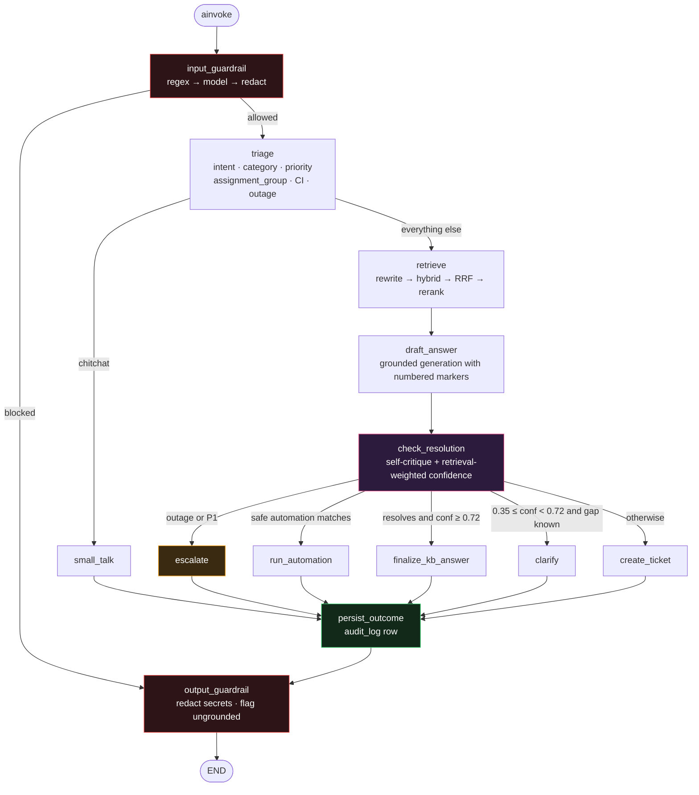
```mermaid
flowchart TD
    START(["ainvoke"]) --> IG["input_guardrail<br/>regex → model → redact"]

    IG -->|"blocked"| OG
    IG -->|"allowed"| TR["triage<br/>intent · category · priority<br/>assignment_group · CI · outage"]

    TR -->|"chitchat"| ST["small_talk"]
    TR -->|"everything else"| RE["retrieve<br/>rewrite → hybrid → RRF → rerank"]

    RE --> DA["draft_answer<br/>grounded generation with numbered markers"]
    DA --> CR["check_resolution<br/>self-critique + retrieval-weighted confidence"]

    CR -->|"outage or P1"| ES["escalate"]
    CR -->|"safe automation matches"| AU["run_automation"]
    CR -->|"resolves and conf ≥ 0.72"| KB["finalize_kb_answer"]
    CR -->|"0.35 ≤ conf < 0.72 and gap known"| CL["clarify"]
    CR -->|"otherwise"| CT["create_ticket"]

    ST --> PO
    ES --> PO
    AU --> PO
    KB --> PO
    CL --> PO
    CT --> PO["persist_outcome<br/>audit_log row"]

    PO --> OG["output_guardrail<br/>redact secrets · flag ungrounded"]
    OG --> END(["END"])

    style IG fill:#2d1416,stroke:#ef4444,color:#fff
    style OG fill:#2d1416,stroke:#ef4444,color:#fff
    style CR fill:#2d1b3d,stroke:#e94f8a,color:#fff
    style ES fill:#3b2a12,stroke:#f59e0b,color:#fff
    style PO fill:#12291a,stroke:#4ade80,color:#fff
```

### State transitions with checkpointing

Every node commits state to Postgres before the next one starts. That is what
makes resume, replay and human-in-the-loop possible.

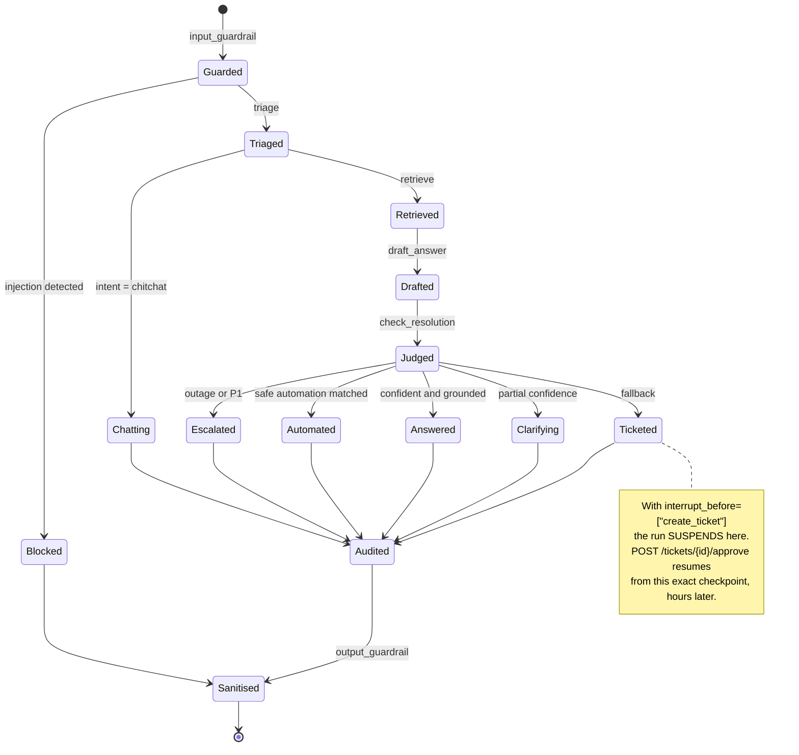
```mermaid
stateDiagram-v2
    [*] --> Guarded: input_guardrail
    Guarded --> Blocked: injection detected
    Guarded --> Triaged: triage

    Triaged --> Chatting: intent = chitchat
    Triaged --> Retrieved: retrieve

    Retrieved --> Drafted: draft_answer
    Drafted --> Judged: check_resolution

    Judged --> Escalated: outage or P1
    Judged --> Automated: safe automation matched
    Judged --> Answered: confident and grounded
    Judged --> Clarifying: partial confidence
    Judged --> Ticketed: fallback

    Escalated --> Audited
    Automated --> Audited
    Answered --> Audited
    Clarifying --> Audited
    Ticketed --> Audited
    Chatting --> Audited
    Blocked --> Sanitised

    Audited --> Sanitised: output_guardrail
    Sanitised --> [*]

    note right of Ticketed
        With interrupt_before=["create_ticket"]
        the run SUSPENDS here.
        POST /tickets/{id}/approve resumes
        from this exact checkpoint, hours later.
    end note
```

### Node responsibilities

| Node | File | Reads from state | Writes to state | Model calls |
|---|---|---|---|---|
| `input_guardrail` | `nodes/guardrails.py` | `message` | `allowed`, `redacted_message`, `guardrail_reasons` | 0–1 |
| `triage` | `nodes/triage.py` | `redacted_message`, `history` | `intent`, `category`, `priority`, `assignment_group`, `affected_ci`, `is_outage` | 1 |
| `retrieve` | `nodes/retrieve.py` | `redacted_message`, `affected_ci`, `metadata.acl_groups` | `retrieved`, `citations`, `rewritten_queries`, `similar_tickets` | 2–8 |
| `draft_answer` | `nodes/resolve.py` | `retrieved`, `history` | `draft_answer`, `usage` | 1 |
| `check_resolution` | `nodes/resolve.py` | `draft_answer`, `retrieved` | `resolves`, `confidence`, `missing`, `risk_flags` | 1 |
| `finalize_kb_answer` | `nodes/resolve.py` | `draft_answer` | `answer`, `resolution_path` | 0 |
| `run_automation` | `nodes/act.py` | `redacted_message`, `user_id` | `answer`, `automation_run` | 0 |
| `create_ticket` | `nodes/act.py` | everything | `ticket_id`, `ticket_number`, `answer` | 1 |
| `escalate` | `nodes/act.py` | everything | as above + `requires_human` | 1 |
| `clarify` | `nodes/act.py` | `missing` | `answer` | 1 |
| `small_talk` | `nodes/act.py` | — | `answer` | 0 |
| `persist_outcome` | `graph.py` | everything | — | 0 |
| `output_guardrail` | `nodes/guardrails.py` | `answer`, `citations` | `answer`, `risk_flags` | 0 |

A typical KB-resolution turn: **6–11 model calls**, ~3–5 seconds, ~$0.004 on
`gpt-4o-mini`. The retrieval stage dominates the call count; that is deliberate
and it is where the quality comes from.

---

## 6. The routing decision

The single most important function in the repo: `graph.py::_decide()`. It is a
plain function over state — **no model call**. Same input, same branch, every
time. That makes it unit-testable (`tests/test_routing.py`) and explainable in a
change advisory board meeting.

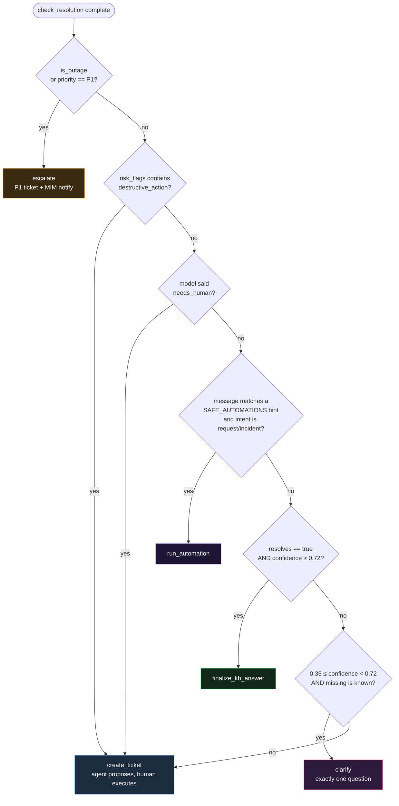
```mermaid
flowchart TD
    S(["check_resolution complete"]) --> R1{"is_outage<br/>or priority == P1?"}
    R1 -->|yes| ESC["escalate<br/>P1 ticket + MIM notify"]
    R1 -->|no| R2{"risk_flags contains<br/>destructive_action?"}
    R2 -->|yes| TKT["create_ticket<br/>agent proposes, human executes"]
    R2 -->|no| R3{"model said<br/>needs_human?"}
    R3 -->|yes| TKT
    R3 -->|no| R4{"message matches a<br/>SAFE_AUTOMATIONS hint<br/>and intent is request/incident?"}
    R4 -->|yes| AUT["run_automation"]
    R4 -->|no| R5{"resolves == true<br/>AND confidence ≥ 0.72?"}
    R5 -->|yes| KBA["finalize_kb_answer"]
    R5 -->|no| R6{"0.35 ≤ confidence < 0.72<br/>AND missing is known?"}
    R6 -->|yes| CLR["clarify<br/>exactly one question"]
    R6 -->|no| TKT

    style ESC fill:#3b2a12,stroke:#f59e0b,color:#fff
    style TKT fill:#1c2b3d,stroke:#60a5fa,color:#fff
    style KBA fill:#12291a,stroke:#4ade80,color:#fff
    style AUT fill:#1c1633,stroke:#a78bfa,color:#fff
    style CLR fill:#2d1b3d,stroke:#e94f8a,color:#fff
```

### The confidence calculation

This is the part reviewers should look at hardest.

```
confidence = 0.6 × model_self_report  +  0.4 × (top_rerank_score / 10)
```

A model asked *"did you answer this well?"* will say yes far too often. Blending
in the reranker's score for the best retrieved passage means **a fluent answer
built on weak passages cannot clear the auto-resolve bar**. If retrieval found
nothing above the rerank threshold, `retrieval_confidence` floors at 0.4 and the
blend lands well below 0.72 — straight to a ticket.

| Scenario | Model says | Top rerank | Confidence | Route |
|---|---|---|---|---|
| Exact runbook match | 0.90 | 9.0 | 0.90 | `finalize_kb_answer` |
| Fluent but ungrounded | 0.85 | 2.0 | 0.59 | `clarify` or `create_ticket` |
| Right topic, wrong specifics | 0.60 | 6.0 | 0.60 | `clarify` |
| Nothing retrieved | 0.10 | — | 0.10 | `create_ticket` |
| Outage | anything | anything | irrelevant | `escalate` |

### Tuning autonomy

`MIN_CONFIDENCE_TO_AUTO_RESOLVE` is the dial. Start high, lower it as your eval
numbers earn it.

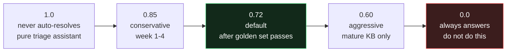
```mermaid
graph LR
    A["1.0<br/>never auto-resolves<br/>pure triage assistant"] --> B["0.85<br/>conservative<br/>week 1-4"]
    B --> C["0.72<br/>default<br/>after golden set passes"]
    C --> D["0.60<br/>aggressive<br/>mature KB only"]
    D --> E["0.0<br/>always answers<br/>do not do this"]

    style C fill:#12291a,stroke:#4ade80,color:#fff
    style E fill:#3b1d1d,stroke:#ef4444,color:#fff
```

---

## 7. The retrieval pipeline

Answer quality lives here far more than in model choice. `app/retrieval/pipeline.py`.

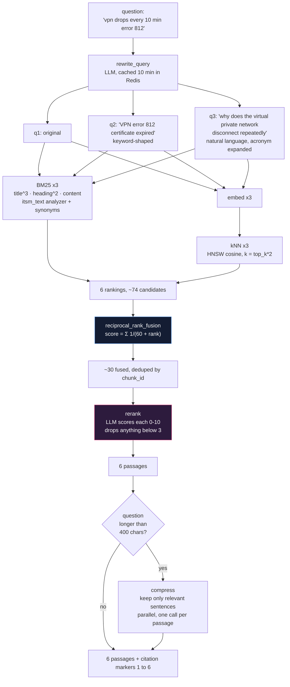
```mermaid
flowchart TD
    Q["question:<br/>'vpn drops every 10 min error 812'"] --> RW["rewrite_query<br/>LLM, cached 10 min in Redis"]
    RW --> Q1["q1: original"]
    RW --> Q2["q2: 'VPN error 812 certificate expired'<br/>keyword-shaped"]
    RW --> Q3["q3: 'why does the virtual private network<br/>disconnect repeatedly'<br/>natural language, acronym expanded"]

    Q1 & Q2 & Q3 --> BM["BM25 x3<br/>title^3 · heading^2 · content<br/>itsm_text analyzer + synonyms"]
    Q1 & Q2 & Q3 --> EMB["embed x3"] --> KNN["kNN x3<br/>HNSW cosine, k = top_k*2"]

    BM --> F["6 rankings, ~74 candidates"]
    KNN --> F

    F --> RRF["reciprocal_rank_fusion<br/>score = Σ 1/(60 + rank)"]
    RRF --> C30["~30 fused, deduped by chunk_id"]
    C30 --> RR["rerank<br/>LLM scores each 0-10<br/>drops anything below 3"]
    RR --> C6["6 passages"]
    C6 --> CMP{"question<br/>longer than<br/>400 chars?"}
    CMP -->|yes| CO["compress<br/>keep only relevant sentences<br/>parallel, one call per passage"]
    CMP -->|no| OUT
    CO --> OUT["6 passages + citation markers 1 to 6"]

    style RRF fill:#141d33,stroke:#60a5fa,color:#fff
    style RR fill:#2d1b3d,stroke:#e94f8a,color:#fff
```

### Why RRF and not weighted score blending

BM25 scores are unbounded and corpus-dependent. Cosine similarity sits in
`[0,1]`. Any fixed weighting you tune today is wrong the moment someone bulk-
imports 4,000 Confluence pages. **Rank position is stable across both.**

```
RRF(d) = Σ over rankings r of  1 / (k + rank_r(d))     where k = 60
```

A document at rank 1 in BM25 and rank 3 in kNN beats a document at rank 1 in one
list and absent from the other. Which is exactly what you want: agreement across
two independent retrieval signals is the strongest evidence you have.

Worked example from `tests/test_fusion.py`:

| chunk | BM25 rank | kNN rank | RRF score | final |
|---|---|---|---|---|
| `b` | 2 | 1 | 1/62 + 1/61 = 0.0325 | **1st** |
| `a` | 1 | — | 1/61 = 0.0164 | 2nd |
| `c` | — | 2 | 1/62 = 0.0161 | 3rd |

### Filters and tenant isolation

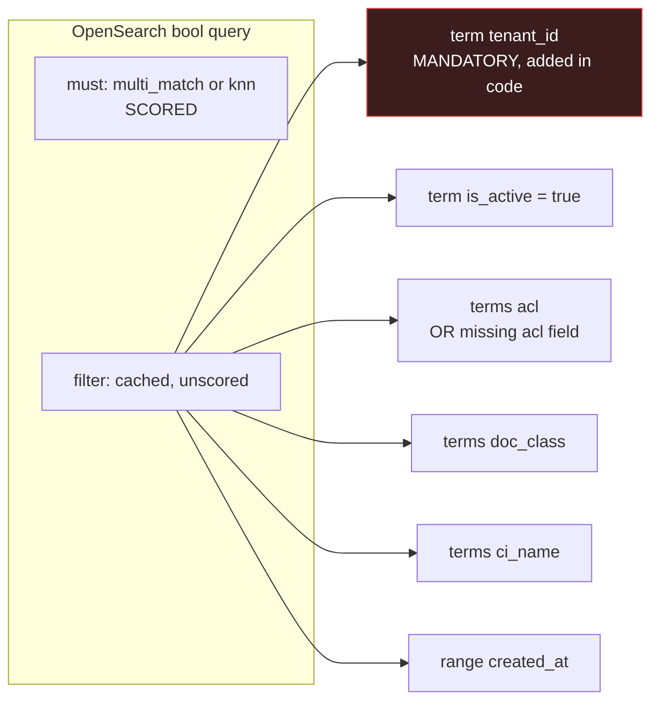
```mermaid
graph LR
    subgraph "OpenSearch bool query"
        M["must: multi_match or knn<br/>SCORED"]
        F["filter: cached, unscored"]
    end

    F --> T["term tenant_id<br/>MANDATORY, added in code"]
    F --> A["term is_active = true"]
    F --> AC["terms acl<br/>OR missing acl field"]
    F --> DC["terms doc_class"]
    F --> CI["terms ci_name"]
    F --> DT["range created_at"]

    style T fill:#3b1d1d,stroke:#ef4444,color:#fff
```

Tenant isolation is a clause built by `_filters()` in code, not something a
caller can influence. There is no query string path that drops it.

**The CI filter self-heals.** If filtering by configuration item starves the
result set, `nodes/retrieve.py` retries unfiltered rather than answering from
nothing. A narrow filter producing zero passages is worse than a broad one
producing six — the reranker will sort it out.

### Why keep pgvector when OpenSearch exists

Not redundancy for its own sake. Three concrete jobs:

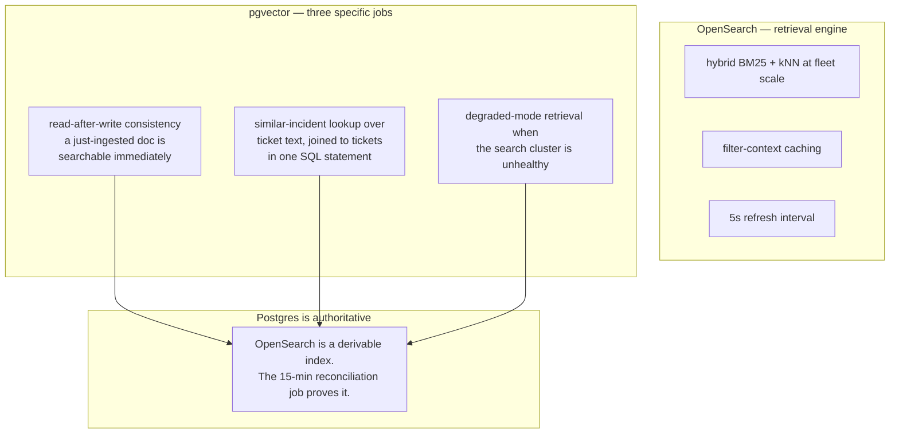
```mermaid
graph TB
    subgraph "OpenSearch — retrieval engine"
        O1["hybrid BM25 + kNN at fleet scale"]
        O2["filter-context caching"]
        O3["5s refresh interval"]
    end
    subgraph "pgvector — three specific jobs"
        P1["read-after-write consistency<br/>a just-ingested doc is<br/>searchable immediately"]
        P2["similar-incident lookup over<br/>ticket text, joined to tickets<br/>in one SQL statement"]
        P3["degraded-mode retrieval when<br/>the search cluster is unhealthy"]
    end
    subgraph "Postgres is authoritative"
        R["OpenSearch is a derivable index.<br/>The 15-min reconciliation job proves it."]
    end
    P1 --> R
    P2 --> R
    P3 --> R
```

---

## 8. The ingestion pipeline

The HTTP request does four cheap things and returns in under a second.
Everything expensive happens in a Celery worker.

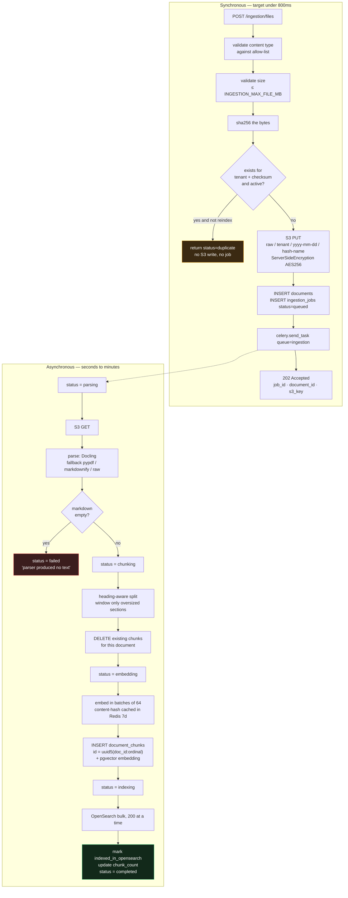
```mermaid
flowchart TD
    subgraph SYNC["Synchronous — target under 800ms"]
        U["POST /ingestion/files"] --> V1["validate content type<br/>against allow-list"]
        V1 --> V2["validate size<br/>≤ INGESTION_MAX_FILE_MB"]
        V2 --> H["sha256 the bytes"]
        H --> D{"exists for<br/>tenant + checksum<br/>and active?"}
        D -->|"yes and not reindex"| DUP["return status=duplicate<br/>no S3 write, no job"]
        D -->|no| S3P["S3 PUT<br/>raw / tenant / yyyy-mm-dd / hash-name<br/>ServerSideEncryption AES256"]
        S3P --> DB["INSERT documents<br/>INSERT ingestion_jobs status=queued"]
        DB --> QQ["celery.send_task queue=ingestion"]
        QQ --> R202["202 Accepted<br/>job_id · document_id · s3_key"]
    end

    subgraph ASYNC["Asynchronous — seconds to minutes"]
        QQ -.-> W1["status = parsing"]
        W1 --> W2["S3 GET"]
        W2 --> W3["parse: Docling<br/>fallback pypdf / markdownify / raw"]
        W3 --> W3a{"markdown<br/>empty?"}
        W3a -->|yes| FAIL["status = failed<br/>'parser produced no text'"]
        W3a -->|no| W4["status = chunking"]
        W4 --> W5["heading-aware split<br/>window only oversized sections"]
        W5 --> W6["DELETE existing chunks<br/>for this document"]
        W6 --> W7["status = embedding"]
        W7 --> W8["embed in batches of 64<br/>content-hash cached in Redis 7d"]
        W8 --> W9["INSERT document_chunks<br/>id = uuid5(doc_id:ordinal)<br/>+ pgvector embedding"]
        W9 --> W10["status = indexing"]
        W10 --> W11["OpenSearch bulk, 200 at a time"]
        W11 --> W12["mark indexed_in_opensearch<br/>update chunk_count<br/>status = completed"]
    end

    style DUP fill:#3b2a12,stroke:#f59e0b,color:#fff
    style FAIL fill:#3b1d1d,stroke:#ef4444,color:#fff
    style W12 fill:#12291a,stroke:#4ade80,color:#fff
```

### Job state machine

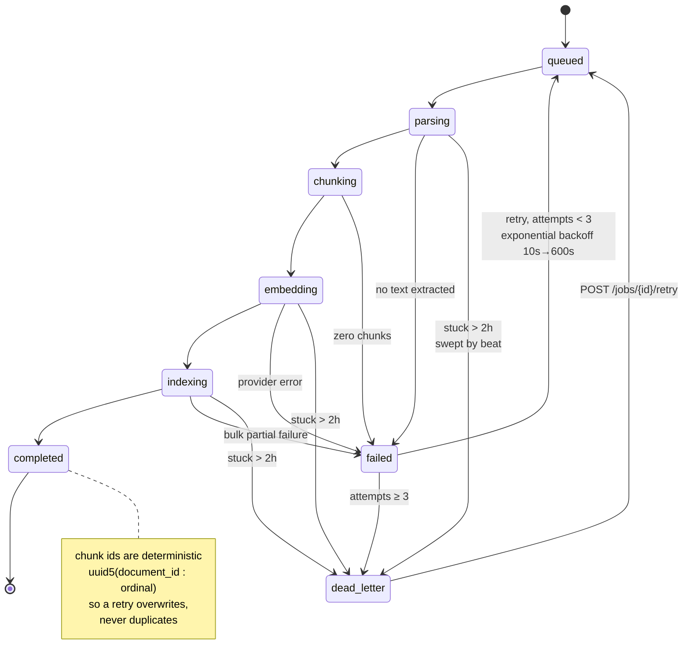
```mermaid
stateDiagram-v2
    [*] --> queued
    queued --> parsing
    parsing --> chunking
    chunking --> embedding
    embedding --> indexing
    indexing --> completed
    completed --> [*]

    parsing --> failed: no text extracted
    chunking --> failed: zero chunks
    embedding --> failed: provider error
    indexing --> failed: bulk partial failure

    failed --> queued: retry, attempts < 3<br/>exponential backoff 10s→600s
    failed --> dead_letter: attempts ≥ 3

    parsing --> dead_letter: stuck > 2h<br/>swept by beat
    embedding --> dead_letter: stuck > 2h
    indexing --> dead_letter: stuck > 2h

    dead_letter --> queued: POST /jobs/{id}/retry

    note right of completed
        chunk ids are deterministic
        uuid5(document_id : ordinal)
        so a retry overwrites,
        never duplicates
    end note
```

### Reconciliation — the part most pipelines skip

Postgres and OpenSearch **will** drift. A bulk index that fails halfway through a
1,200-chunk PDF leaves rows in Postgres with no searchable counterpart.

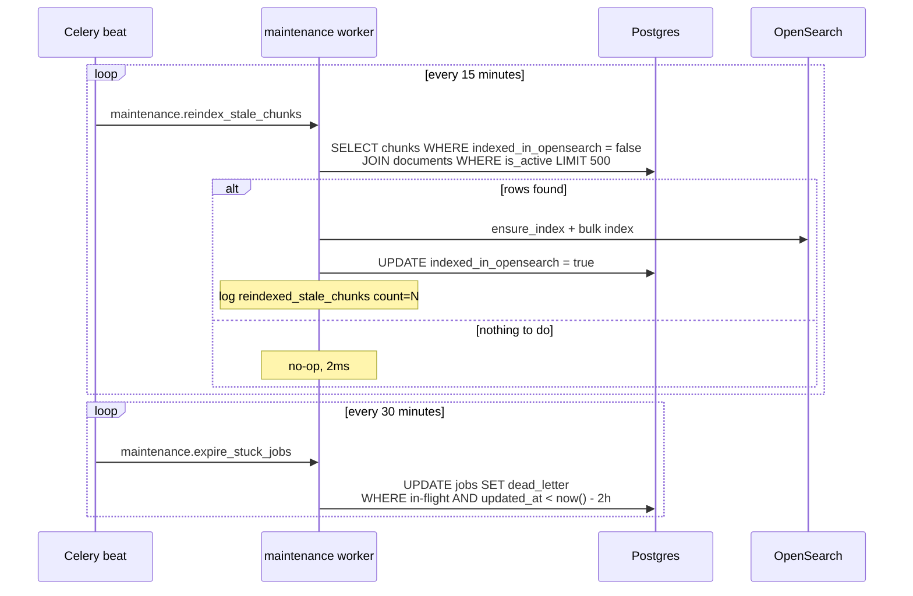
```mermaid
sequenceDiagram
    participant B as Celery beat
    participant W as maintenance worker
    participant PG as Postgres
    participant OS as OpenSearch

    loop every 15 minutes
        B->>W: maintenance.reindex_stale_chunks
        W->>PG: SELECT chunks WHERE indexed_in_opensearch = false<br/>JOIN documents WHERE is_active LIMIT 500
        alt rows found
            W->>OS: ensure_index + bulk index
            W->>PG: UPDATE indexed_in_opensearch = true
            Note over W: log reindexed_stale_chunks count=N
        else nothing to do
            Note over W: no-op, 2ms
        end
    end

    loop every 30 minutes
        B->>W: maintenance.expire_stuck_jobs
        W->>PG: UPDATE jobs SET dead_letter<br/>WHERE in-flight AND updated_at < now() - 2h
    end
```

This is the only reliable way to recover, and it means **you can drop the entire
OpenSearch index and rebuild it from Postgres** — which is exactly the property
you want when you change the embedding model.

### Chunking strategy

Runbooks are numbered procedures. Splitting on a fixed character window shreds
"step 3 of 5" in half, and the model then produces a confidently wrong answer —
which in ITSM means someone runs half a remediation on production.

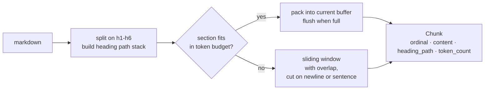
```mermaid
flowchart LR
    MD["markdown"] --> SEC["split on h1-h6<br/>build heading path stack"]
    SEC --> LOOP{"section fits<br/>in token budget?"}
    LOOP -->|yes| PACK["pack into current buffer<br/>flush when full"]
    LOOP -->|no| WIN["sliding window<br/>with overlap,<br/>cut on newline or sentence"]
    PACK --> OUT["Chunk<br/>ordinal · content · heading_path · token_count"]
    WIN --> OUT
```

Every chunk carries its full heading path — `VPN Troubleshooting › Error 812 ›
Locked accounts` — which is prepended to the content before embedding. That
single detail measurably improves retrieval on structured docs, because the
embedding now knows what the chunk is *about* and not just what words are in it.

---

## 9. Data model

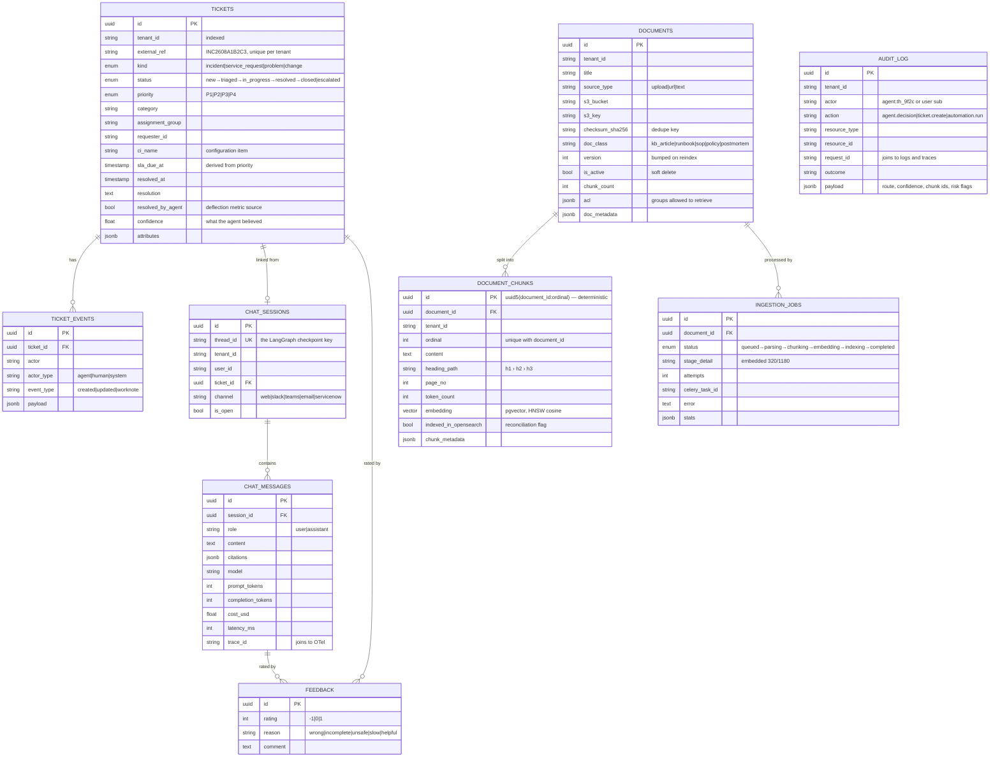
```mermaid
erDiagram
    TICKETS ||--o{ TICKET_EVENTS : "has"
    TICKETS ||--o| CHAT_SESSIONS : "linked from"
    TICKETS ||--o{ FEEDBACK : "rated by"
    DOCUMENTS ||--o{ DOCUMENT_CHUNKS : "split into"
    DOCUMENTS ||--o{ INGESTION_JOBS : "processed by"
    CHAT_SESSIONS ||--o{ CHAT_MESSAGES : "contains"
    CHAT_MESSAGES ||--o{ FEEDBACK : "rated by"

    TICKETS {
        uuid id PK
        string tenant_id "indexed"
        string external_ref "INC2608A1B2C3, unique per tenant"
        enum kind "incident|service_request|problem|change"
        enum status "new→triaged→in_progress→resolved→closed|escalated"
        enum priority "P1|P2|P3|P4"
        string category
        string assignment_group
        string requester_id
        string ci_name "configuration item"
        timestamp sla_due_at "derived from priority"
        timestamp resolved_at
        text resolution
        bool resolved_by_agent "deflection metric source"
        float confidence "what the agent believed"
        jsonb attributes
    }

    DOCUMENT_CHUNKS {
        uuid id PK "uuid5(document_id:ordinal) — deterministic"
        uuid document_id FK
        string tenant_id
        int ordinal "unique with document_id"
        text content
        string heading_path "h1 › h2 › h3"
        int page_no
        int token_count
        vector embedding "pgvector, HNSW cosine"
        bool indexed_in_opensearch "reconciliation flag"
        jsonb chunk_metadata
    }

    DOCUMENTS {
        uuid id PK
        string tenant_id
        string title
        string source_type "upload|url|text"
        string s3_bucket
        string s3_key
        string checksum_sha256 "dedupe key"
        string doc_class "kb_article|runbook|sop|policy|postmortem"
        int version "bumped on reindex"
        bool is_active "soft delete"
        int chunk_count
        jsonb acl "groups allowed to retrieve"
        jsonb doc_metadata
    }

    INGESTION_JOBS {
        uuid id PK
        uuid document_id FK
        enum status "queued→parsing→chunking→embedding→indexing→completed"
        string stage_detail "embedded 320/1180"
        int attempts
        string celery_task_id
        text error
        jsonb stats
    }

    CHAT_SESSIONS {
        uuid id PK
        string thread_id UK "the LangGraph checkpoint key"
        string tenant_id
        string user_id
        uuid ticket_id FK
        string channel "web|slack|teams|email|servicenow"
        bool is_open
    }

    CHAT_MESSAGES {
        uuid id PK
        uuid session_id FK
        string role "user|assistant"
        text content
        jsonb citations
        string model
        int prompt_tokens
        int completion_tokens
        float cost_usd
        int latency_ms
        string trace_id "joins to OTel"
    }

    TICKET_EVENTS {
        uuid id PK
        uuid ticket_id FK
        string actor
        string actor_type "agent|human|system"
        string event_type "created|updated|worknote"
        jsonb payload
    }

    FEEDBACK {
        uuid id PK
        int rating "-1|0|1"
        string reason "wrong|incomplete|unsafe|slow|helpful"
        text comment
    }

    AUDIT_LOG {
        uuid id PK
        string tenant_id
        string actor "agent:th_9f2c or user sub"
        string action "agent.decision|ticket.create|automation.run"
        string resource_type
        string resource_id
        string request_id "joins to logs and traces"
        string outcome
        jsonb payload "route, confidence, chunk ids, risk flags"
    }
```

### Ownership and rebuildability

| Data | Authoritative store | Derived copies | Rebuild path |
|---|---|---|---|
| Raw file bytes | S3 | — | irreplaceable, versioned bucket |
| Document metadata | Postgres | OpenSearch `_source` | reindex from `documents` |
| Chunk text + vectors | Postgres | OpenSearch `knn_vector` | `maintenance.reindex_stale_chunks` |
| Tickets and events | Postgres | — | backup/restore |
| Conversation state | Postgres checkpoints | Redis history cache | cache is disposable |
| Spend counters | Redis | Prometheus counters | resets daily by design |
| Rate limit counters | Redis | — | resets every 60s by design |

**Postgres is authoritative for everything except raw bytes.** Redis and
OpenSearch are both fully disposable. That is a deliberate constraint, and the
reconciliation job continuously proves it holds.

### Indexes that matter

```sql
-- vector similarity: HNSW, not IVFFlat
CREATE INDEX ix_chunks_embedding_hnsw ON document_chunks
  USING hnsw (embedding vector_cosine_ops) WITH (m = 16, ef_construction = 64);

-- fuzzy content match for degraded-mode search
CREATE INDEX ix_chunks_content_trgm ON document_chunks
  USING gin (content gin_trgm_ops);

-- the query the analyst queue actually runs
CREATE INDEX ix_tickets_tenant_status_created ON tickets (tenant_id, status, created_at);
```

HNSW over IVFFlat because there is no training step and recall stays stable as
the KB grows article by article rather than in bulk loads — which is how a real
knowledge base grows.

---

## 10. Storage layouts

### Redis key map

Every key is namespaced under `REDIS_NAMESPACE` (default `itsm`).

```
itsm:ratelimit:{tenant}:{identity}          INCR + EXPIRE 60s      atomic Lua
itsm:idem:{idempotency_key}                 JSON, 24h              in_flight → done+response
itsm:budget:{YYYYMMDD}:{tenant}             INCRBYFLOAT, 3d TTL    USD spent today
itsm:chat:history:{thread_id}               JSON list, 1h          last 10 turns
itsm:llm:completion:{hash}                  JSON, 1h               semantic cache slot
itsm:llm:embedding:{sha256(model:text)}     JSON vector, 7d        makes re-ingest nearly free
itsm:retrieval:query:rw:{tenant}:{hash}     JSON list, 10m         rewritten query variants
```

The embedding cache is the one with real money attached. Re-ingesting a
1,200-chunk document after a chunking-parameter change costs nothing if the
chunk text is unchanged.

### OpenSearch index design

```mermaid
graph TB
    subgraph "itsm-knowledge-v1"
        subgraph "settings"
            S1["knn: true<br/>ef_search: 128"]
            S2["3 shards, 1 replica"]
            S3["refresh_interval: 5s"]
            S4["analyzer itsm_text:<br/>standard → lowercase<br/>→ synonym_graph → english_stemmer"]
        end
        subgraph "mappings"
            M1["text: title^3, content, heading_path^2<br/>analyzed with itsm_text"]
            M2["keyword: tenant_id, document_id, chunk_id,<br/>doc_class, ci_name, category, acl"]
            M3["knn_vector embedding<br/>HNSW, lucene, cosinesimil<br/>m=24, ef_construction=256"]
        end
    end
```

The synonym set is ITSM-specific and lives in `opensearch_store.ITSM_SYNONYMS`:

```
vpn ↔ virtual private network
mfa ↔ 2fa ↔ two factor ↔ multifactor
sso ↔ single sign on
pw ↔ pwd ↔ password ↔ passcode
laptop ↔ notebook ↔ workstation
outage ↔ downtime ↔ unavailable
ad ↔ active directory
vdi ↔ virtual desktop
```

Add yours. This is the cheapest retrieval improvement available — no embedding
change, no reindex of vectors, just a settings update and a rolling restart.

> **Index versioning.** The index name carries `-v1`. When you change the
> embedding model or the analyzer, create `-v2`, backfill from Postgres with
> `reindex_stale_chunks`, then flip `OPENSEARCH_INDEX`. Zero-downtime, and the
> old index stays as a rollback.

### S3 key layout

```
s3://itsm-ingestion/
└── raw/
    └── {tenant_id}/
        └── {YYYY}/{MM}/{DD}/
            └── {sha256[:12]}-{original-filename}
```

Content-addressed prefix means the same file uploaded twice produces the same
key. Date partitioning keeps lifecycle rules simple — transition to IA at 90
days, Glacier at 365. Objects are written with `ServerSideEncryption: AES256`
and read only through presigned URLs with a 15-minute expiry.

---

## 11. Failure modes

What actually happens when each dependency degrades. This table is the one your
SRE will ask for.

| Failure | Detection | Behaviour | Blast radius |
|---|---|---|---|
| **Model provider down** | LiteLLM raises after retries | Falls back to `FALLBACK_MODELS` in order; if all fail → `UpstreamError` 502 | Chat degraded, ingestion queues up and drains later |
| **Model provider slow** | 45s timeout | Retries twice with backoff, then fallback | Higher latency, no data loss |
| **OpenSearch down** | `health()` reachable=false, `/health/ready` returns 503 | Retrieval raises `UpstreamError`; `pgvector` strategy still works if invoked | KB answers degraded; ticket creation unaffected |
| **OpenSearch partial bulk failure** | `bulk_index` inspects `response["errors"]` | Raises, task retries; chunks stay `indexed_in_opensearch=false` and get swept in ≤15 min | Some docs temporarily unsearchable |
| **Redis down** | ping fails at boot, logged | Rate limiting fails closed on the middleware path; cache misses fall through to Postgres; budget check errors | Degraded, not down |
| **Postgres down** | `/health/ready` 503 | Hard failure — it is the system of record | Full outage. Run it HA. |
| **Celery worker killed mid-parse** | `task_acks_late` + `reject_on_worker_lost` | Task redelivered to another worker; deterministic chunk ids make the retry idempotent | None |
| **Job stuck in-flight** | `updated_at` older than 2h | Beat sweeps to `dead_letter`, visible in `/ingestion/jobs?status=dead_letter` | One document |
| **Guardrail model call fails** | exception in `input_guardrail` | **Fails open**, logs a warning — deterministic regex checks already ran | A rude message might get through. Better than a dead service desk. |
| **Injection pattern matched** | regex, deterministic | **Fails closed**, immediate block, no model call | Intended |
| **Reranker fails** | exception in `rerank` | Falls back to RRF fusion order, `top_n` truncation | Slightly worse ordering |
| **Query rewrite fails** | exception | Falls back to the original question only | Slightly narrower recall |
| **Budget exhausted** | Redis counter ≥ cap | HTTP 402 before any model call | That tenant only, resets at UTC midnight |
| **Any agent node raises** | `_instrument` wrapper | Appends to `state["errors"]`, graph continues | Answer degraded, conversation survives |

### Degradation ladder

```mermaid
graph TD
    F["Full service<br/>hybrid retrieval, reranking, automation"] -->|"reranker fails"| D1["Fusion-order retrieval<br/>slightly worse ordering"]
    D1 -->|"OpenSearch degraded"| D2["pgvector-only retrieval<br/>vector, no BM25"]
    D2 -->|"embeddings fail"| D3["No retrieval<br/>every request becomes a ticket"]
    D3 -->|"all models fail"| D4["Ticket intake only<br/>no triage, no answers"]
    D4 -->|"Postgres down"| D5["Outage"]

    style F fill:#12291a,stroke:#4ade80,color:#fff
    style D3 fill:#3b2a12,stroke:#f59e0b,color:#fff
    style D5 fill:#3b1d1d,stroke:#ef4444,color:#fff
```

Note what survives at level D3–D4: **ticket intake still works**. Users can still
report problems even when every model provider is down, because ticket creation
does not require a model call to succeed — it only requires one to be *better*.

---

## 12. Observability

Three layers, all out of band. Nothing in the request path blocks on an export.

```mermaid
graph LR
    subgraph "in-process"
        REQ["HTTP request"]
        NODE["agent nodes"]
        LLMC["LiteLLM calls"]
        WORK["Celery tasks"]
    end

    subgraph "OpenTelemetry"
        SP["spans<br/>BatchSpanProcessor"]
        OTLP["OTLP gRPC exporter"]
    end

    subgraph "Langfuse"
        GEN["generations<br/>prompt · completion · cost · purpose"]
    end

    subgraph "Prometheus"
        MET["/metrics scrape"]
    end

    REQ --> SP
    NODE --> SP
    LLMC --> SP
    WORK --> SP
    SP --> OTLP --> JG["Jaeger / Tempo / Datadog"]

    LLMC -->|"success_callback"| GEN --> LFUI["Langfuse UI<br/>trace by session_id = thread_id"]

    REQ --> MET
    NODE --> MET
    LLMC --> MET
    WORK --> MET
    MET --> GRAF["Grafana"]
```

### The trace waterfall for one chat turn

What you see in Jaeger for a single `POST /chat` that ends in a KB answer:

```
POST /api/v1/chat                                            4,180 ms
├── agent.invoke                                             4,050 ms
│   ├── input_guardrail                                        310 ms
│   │   └── llm.complete  purpose=input_guardrail              290 ms
│   ├── triage                                                 720 ms
│   │   └── llm.complete  purpose=triage                       680 ms
│   ├── retrieve                                             1,340 ms
│   │   ├── retrieval.pipeline                               1,320 ms
│   │   │   ├── llm.complete  purpose=query_rewrite            240 ms
│   │   │   ├── opensearch bm25 x3                       (parallel)  90 ms
│   │   │   ├── llm.embed  batch=3                             150 ms
│   │   │   ├── opensearch knn x3                       (parallel) 110 ms
│   │   │   ├── rrf fusion                                       2 ms
│   │   │   └── llm.complete  purpose=rerank                   700 ms
│   ├── draft_answer                                         1,210 ms
│   │   └── llm.complete  purpose=answer                     1,190 ms
│   ├── check_resolution                                       430 ms
│   │   └── llm.complete  purpose=resolution_check             410 ms
│   ├── finalize_kb_answer                                       1 ms
│   ├── persist_outcome                                         28 ms
│   └── output_guardrail                                         4 ms
└── persist assistant message                                   95 ms
```

The two obvious optimisation targets are visible immediately: the reranker
(700 ms) and the answer generation (1,190 ms). Swap the reranker for a
cross-encoder and you save ~600 ms; the interface in `pipeline.rerank` already
isolates it.

### Metrics

```
itsm_http_requests_total{method,route,status,tenant}
itsm_http_request_seconds{route}                    histogram
itsm_llm_calls_total{model,outcome,purpose}
itsm_llm_tokens_total{model,kind}
itsm_llm_cost_usd_total{model,tenant}
itsm_agent_node_seconds{node}                       histogram
itsm_agent_routes_total{decision}                   ← put this on the wall
itsm_retrieval_hits{strategy}                       histogram
itsm_ingest_documents_total{status}
itsm_ingest_queue_depth                             gauge
```

`itsm_agent_routes_total` is your deflection rate, live:

```promql
sum(rate(itsm_agent_routes_total{decision=~"finalize_kb_answer|run_automation"}[1h]))
/
sum(rate(itsm_agent_routes_total[1h]))
```

Alerts worth having on day one:

```promql
# deflection collapsed — usually means retrieval broke
deflection_rate < 0.10 for 30m

# the agent is escalating everything
rate(itsm_agent_routes_total{decision="escalate"}[15m]) > 3x baseline

# spend running away
increase(itsm_llm_cost_usd_total[1h]) > hourly_budget

# ingestion silently stopped
itsm_ingest_queue_depth > 100 for 20m

# p95 latency
histogram_quantile(0.95, itsm_http_request_seconds_bucket{route="/api/v1/chat"}) > 12
```

### Correlation

One `request_id` threads through everything:

```mermaid
graph LR
    RID["x-request-id header"] --> LOG["every structlog line"]
    RID --> SPAN["OTel span attribute"]
    RID --> MSG["chat_messages.trace_id"]
    RID --> AUD["audit_log.request_id"]
    RID --> RESP["response header"]
```

A user forwards you a screenshot with a request id in it. You get the log lines,
the trace, the exact passages retrieved, the confidence, and the routing
decision. That is the whole point.

---

## 13. Security and governance

### Trust boundaries

```mermaid
graph TB
    subgraph UNTRUSTED["Untrusted"]
        U["User message"]
        DOC["Retrieved document content"]
    end

    subgraph EDGE["Edge — authentication boundary"]
        AUTH["get_principal<br/>JWT verify or API key"]
        RL["rate limit"]
    end

    subgraph APP["Application — authorization boundary"]
        RBAC["Principal.require_role"]
        TEN["tenant_id from the principal,<br/>never from the body"]
    end

    subgraph AGENTB["Agent — content boundary"]
        IG["input_guardrail<br/>injection + secrets"]
        SYS["system prompt<br/>never leaked, never overridden"]
        OG["output_guardrail<br/>redact + flag"]
    end

    subgraph ACTION["Action — execution boundary"]
        SAFE["SAFE_AUTOMATIONS allow-list"]
        DEST["DESTRUCTIVE_KEYWORDS gate"]
        PROP["propose, do not execute"]
        AUDIT["audit_log, every action"]
    end

    U --> AUTH --> RL --> RBAC --> TEN --> IG --> SYS
    DOC -.->|"treated as data,<br/>never as instructions"| SYS
    SYS --> OG
    SYS --> SAFE
    SAFE --> DEST --> PROP --> AUDIT

    style UNTRUSTED fill:#3b1d1d,stroke:#ef4444,color:#fff
    style ACTION fill:#12291a,stroke:#4ade80,color:#fff
```

### RBAC matrix

| Endpoint | Required role |
|---|---|
| `POST /chat`, `/chat/stream` | `user` or `agent.invoke` |
| `POST /chat/feedback` | any authenticated |
| `POST /ingestion/*` | `ingest.write` or `admin` |
| `DELETE /ingestion/documents/{id}` | `ingest.write` or `admin` |
| `POST/PATCH /tickets` | any authenticated |
| `POST /tickets/{id}/kb-draft` | `kb.author` or `admin` |
| `POST /tickets/{id}/approve` | `analyst` or `admin` |
| `GET /admin/metrics/itsm` | `admin` or `analyst` |
| all other `/admin/*` | `admin` |

`admin` bypasses individual role checks by design (`Principal.require_role`).

### Responsible AI, concretely

Not a policy paragraph — the actual enforcement points:

| Principle | Where it lives |
|---|---|
| Never invent a KB article or ticket number | `prompts.SYSTEM_SERVICE_DESK` rule 1 + `no_grounding` risk flag |
| Always cite | `[n]` markers required by `prompts.ANSWER`; `citation_validity()` in evals checks the markers point at real passages |
| Say when you don't know | Exact string `"I could not find this in our knowledge base."` short-circuits `check_resolution` to confidence 0.1 |
| Never ask for credentials | System prompt + golden-set assertion `pwd-001` `must_not_contain` |
| No destructive actions | `DESTRUCTIVE_KEYWORDS` + `propose_automation` returns `requires_approval: true` |
| Human oversight available | `interrupt_before` + `POST /tickets/{id}/approve` |
| Full explainability | `audit_log` row per decision with route, confidence, chunk ids, risk flags |
| Cost control | Per-tenant daily budget, checked before every call |
| Data minimisation | Secrets redacted on input and output; `redact()` covers emails, cards, inline passwords, `sk-`/`ghp_`/`AKIA` tokens |
| Tenant isolation | Enforced in the search filter, SQL predicates and the principal — never in a prompt |

### Prompt injection

Deterministic patterns fail **closed**. Model-based judgement fails **open**.

```mermaid
flowchart LR
    M["message"] --> RX{"matches one of 4<br/>injection regexes?"}
    RX -->|yes| BLK["blocked, no model call<br/>generic refusal + ticket offer"]
    RX -->|no| RED["redact secrets"]
    RED --> LEN{"longer than<br/>40 chars?"}
    LEN -->|no| PASS["allow"]
    LEN -->|yes| MOD["one guardrail model call"]
    MOD -->|"error"| FAILOPEN["allow + log warning<br/>regex already ran"]
    MOD -->|"allow=false"| BLK
    MOD -->|"allow=true"| PASS

    style BLK fill:#3b1d1d,stroke:#ef4444,color:#fff
    style FAILOPEN fill:#3b2a12,stroke:#f59e0b,color:#fff
```

That asymmetry is deliberate. Injection is a cheap, clear, deterministic signal.
Content judgement is not — and a service desk that stops working during a model
outage is a worse outcome than one rude message getting through.

---

## 14. Deployment topology

### Local — `make up`

```mermaid
graph TB
    subgraph "docker compose"
        API["api :8000<br/>uvicorn --reload"]
        WK["worker<br/>-Q ingestion,maintenance --concurrency=4"]
        BT["beat<br/>scheduler"]
        FL["flower :5555"]
        PG["postgres :5432<br/>pgvector/pgvector:pg16"]
        RD["redis :6379"]
        OS["opensearch :9200"]
        OSD["dashboards :5601"]
        MN["minio :9000 / :9001"]
    end
    API --> PG & RD & OS & MN
    WK --> PG & RD & OS & MN
    BT --> RD
    FL --> RD
```

### Production shape

```mermaid
graph TB
    subgraph "Edge"
        ALB["Load balancer<br/>TLS termination"]
        WAF["WAF"]
    end

    subgraph "Compute — Kubernetes or ECS"
        API1["api replica 1"]
        API2["api replica 2"]
        API3["api replica N<br/>HPA on CPU + p95 latency"]
        WK1["worker: ingestion queue<br/>HPA on queue depth"]
        WK2["worker: maintenance queue<br/>fixed 1-2"]
        BEAT["beat — exactly one replica"]
    end

    subgraph "Managed data"
        RDS["Postgres HA<br/>primary + replica<br/>pgvector extension"]
        EC["Redis cluster<br/>multi-AZ, AOF"]
        AOS["OpenSearch domain<br/>3 data nodes, 3 AZ"]
        S3B["S3 bucket<br/>versioned, SSE, lifecycle"]
    end

    subgraph "Telemetry"
        OTELC["OTel collector"]
        PROM["Prometheus"]
        LF["Langfuse"]
    end

    WAF --> ALB --> API1 & API2 & API3
    API1 & API2 & API3 --> RDS & EC & AOS & S3B
    WK1 & WK2 --> RDS & EC & AOS & S3B
    BEAT --> EC
    API1 & WK1 -.-> OTELC & PROM & LF

    style BEAT fill:#3b2a12,stroke:#f59e0b,color:#fff
```

Two things that will bite you if you skip them:

- **Beat must be exactly one replica.** Two schedulers means every periodic job
  runs twice. Use a leader-election sidecar or a single-replica Deployment.
- **`api` and `worker` are the same image, different command.** Keep it that
  way — it guarantees the worker has the same parsers, prompts and schema as the
  API that queued the job.

---

## 15. Scaling and capacity

Numbers to size against. Measured on `gpt-4o-mini` + `text-embedding-3-small`;
adjust for your models.

### Per-request cost and latency

| Route taken | Model calls | Latency p50 | Cost | Share of traffic (typical) |
|---|---|---|---|---|
| `small_talk` | 0 | 40 ms | $0 | 5% |
| `finalize_kb_answer` | 8–11 | 3.5 s | ~$0.004 | 30% |
| `run_automation` | 6–8 | 2.8 s | ~$0.003 | 8% |
| `clarify` | 7–9 | 3.0 s | ~$0.003 | 12% |
| `create_ticket` | 8–11 | 4.2 s | ~$0.005 | 40% |
| `escalate` | 8–11 | 4.5 s | ~$0.005 | 2% |
| blocked | 1 | 300 ms | ~$0.0001 | 3% |

At **5,000 conversations/day**: roughly **$20/day** in model spend, ~$600/month.
Compare that to the fully-loaded cost of the tickets deflected at a 30%
deflection rate and the business case writes itself.

### Ingestion throughput

| Document | Chunks | Parse | Embed | Index | Total |
|---|---|---|---|---|---|
| 5-page KB article (md) | 6 | 20 ms | 0.4 s | 60 ms | ~0.5 s |
| 40-page runbook (PDF, Docling) | 95 | 12 s | 2.1 s | 0.4 s | ~15 s |
| 300-page policy manual (PDF) | 780 | 95 s | 14 s | 2.8 s | ~2 min |
| 2,000-article Confluence export | ~24,000 | — | ~7 min | ~2 min | ~45 min at concurrency 4 |

Embedding is batched 64 at a time and cached by content hash, so a re-ingest
after a chunking change is dominated by parse time, not embed cost.

### Scaling levers, in the order you should pull them

```mermaid
graph LR
    A["1. Raise worker concurrency<br/>ingestion queue"] --> B["2. Add api replicas<br/>stateless, HPA on p95"]
    B --> C["3. Redis read replica<br/>if cache hit rate is high"]
    C --> D["4. OpenSearch data nodes<br/>if query latency climbs"]
    D --> E["5. Postgres read replica<br/>for ticket list queries"]
    E --> F["6. Cross-encoder reranker<br/>removes ~600ms and one LLM call"]
    F --> G["7. Semantic cache on<br/>common questions"]
```

The API is fully stateless — conversation state lives in Postgres checkpoints
keyed by `thread_id`, never in process memory. Scale it horizontally without
thinking about it.

### Sizing rules of thumb

| Resource | Guidance |
|---|---|
| API replicas | 1 per ~40 concurrent conversations |
| Ingestion workers | 1 per ~2 concurrent large PDFs |
| Postgres | 4 vCPU / 16 GB handles ~50k chunks + 500k tickets comfortably |
| pgvector HNSW memory | ~`(dim × 4 bytes + 200) × chunk_count`; 100k chunks at 1536d ≈ 640 MB |
| OpenSearch | 3 shards up to ~50 GB; add a shard per 50 GB after that |
| Redis | 512 MB with `allkeys-lru` is generous for 10k daily conversations |

---

## 16. Getting it running

```bash
git clone <your-repo> && cd itsm-agentic-platform
cp .env.example .env
# put a real OPENAI_API_KEY (or ANTHROPIC_API_KEY) in .env

make up          # postgres+pgvector, redis, opensearch, minio, api, worker, beat, flower
make seed        # 5 sample KB articles, 3 tickets
make smoke       # end-to-end verification
```

| | |
|---|---|
| API docs | http://localhost:8000/docs |
| Celery (Flower) | http://localhost:5555 |
| OpenSearch Dashboards | http://localhost:5601 |
| MinIO console | http://localhost:9001 — minioadmin / minioadmin |

Ask it something:

```bash
curl -s localhost:8000/api/v1/chat \
  -H 'Content-Type: application/json' -H 'X-API-Key: local-dev-key' \
  -d '{"message":"My VPN keeps dropping with error 812","user_id":"u1001"}' | jq
```

```json
{
  "thread_id": "th_9f2c4a1b8e3d7f60",
  "message_id": "b1d2...",
  "answer": "Your device certificate has expired or was issued by a retired CA [1]. Open Company Portal → Devices → Check access, wait about two minutes for re-enrolment, then restart the VPN client [1]. If you need access immediately, portal.example.com works in a browser without the VPN [1].",
  "intent": "incident",
  "category": "Network",
  "priority": "P3",
  "confidence": 0.87,
  "resolution_path": "kb_resolution",
  "ticket_id": null,
  "citations": [
    {
      "marker": "[1]",
      "title": "VPN error 812 - certificate expired",
      "heading_path": "VPN error 812 › Resolution",
      "chunk_id": "8f3a...",
      "score": 8.5
    }
  ],
  "suggested_actions": ["Was this helpful?", "Raise a ticket if the issue persists"],
  "steps": [
    {"node": "input_guardrail",  "summary": "allowed",                          "duration_ms": 310},
    {"node": "triage",           "summary": "incident / Network / P3",          "duration_ms": 720},
    {"node": "retrieve",         "summary": "6 passages from 74 candidates",    "duration_ms": 1340},
    {"node": "draft_answer",     "summary": "512 chars, 1190ms",                "duration_ms": 1210},
    {"node": "check_resolution", "summary": "resolves=True confidence=0.87",    "duration_ms": 430},
    {"node": "finalize_kb_answer","summary": "resolved from knowledge base",    "duration_ms": 1},
    {"node": "persist_outcome",  "summary": "audited",                          "duration_ms": 28},
    {"node": "output_guardrail", "summary": "0 flag(s)",                        "duration_ms": 4}
  ],
  "usage": {"model": "openai/gpt-4o-mini", "prompt_tokens": 4820, "completion_tokens": 310, "cost_usd": 0.0041, "latency_ms": 4180},
  "requires_human": false
}
```

The `steps` array is not decoration. It is the explainability surface — paste it
into a ticket comment and an analyst can see exactly what the agent did.

Without Docker:

```bash
make install
make migrate
make dev        # terminal 1 — API
make worker     # terminal 2 — Celery
make beat       # terminal 3 — scheduler
```

---

## 17. API reference

### ChatRouter — `/api/v1/chat`

| Method | Path | Purpose |
|---|---|---|
| POST | `/chat` | Send a message, get a full `ChatResponse` |
| POST | `/chat/stream` | SSE — node-level progress then the final payload |
| GET | `/chat/sessions` | Paged conversation list |
| GET | `/chat/sessions/{thread_id}/messages` | Full transcript with citations |
| POST | `/chat/feedback` | Thumbs up/down → the eval set |

### IngestionRouter — `/api/v1/ingestion`

| Method | Path | Purpose |
|---|---|---|
| POST | `/ingestion/files` | Single upload → S3 → queue. Supports `Idempotency-Key` |
| POST | `/ingestion/batch` | Multiple files in one call |
| POST | `/ingestion/urls` | Fetch and ingest a web page |
| POST | `/ingestion/text` | Paste markdown directly |
| GET | `/ingestion/jobs` | Paged job list, filter by status |
| GET | `/ingestion/jobs/{id}` | Per-stage progress |
| POST | `/ingestion/jobs/{id}/retry` | Requeue a failed or dead-lettered job |
| GET | `/ingestion/documents` | What is indexed |
| GET | `/ingestion/documents/{id}/download` | Presigned S3 URL, 15 min |
| DELETE | `/ingestion/documents/{id}` | Soft-delete + purge from OpenSearch |

### TicketRouter — `/api/v1/tickets`

| Method | Path | Purpose |
|---|---|---|
| POST | `/tickets` | Create, SLA derived from priority |
| GET | `/tickets` | Filter by status, priority, group, requester |
| GET | `/tickets/{id}` | Single ticket |
| PATCH | `/tickets/{id}` | Update; changing priority recalculates SLA |
| GET | `/tickets/{id}/events` | Full audit history |
| GET | `/tickets/sla/at-risk` | Breach warning list |
| GET | `/tickets/problems/candidates` | AI incident clustering |
| POST | `/tickets/{id}/kb-draft` | Resolved incident → KB article draft |
| POST | `/tickets/{id}/approve` | Human-in-the-loop resume |

### KnowledgeRouter — `/api/v1/knowledge`

| Method | Path | Purpose |
|---|---|---|
| POST | `/knowledge/search` | Hybrid search; every pipeline stage tunable per call |
| POST | `/knowledge/answer` | Grounded answer with citations, no agent loop |

`SearchRequest` lets you A/B the pipeline from a curl:

```json
{
  "query": "vpn error 812",
  "top_k": 10,
  "strategy": "hybrid",       // hybrid | vector | keyword | pgvector
  "rerank": true,
  "compress": false,
  "rewrite_query": true,
  "filters": { "doc_class": ["runbook"], "ci_name": ["vpn-gateway-01"] }
}
```

The response carries `bm25_score`, `vector_score` and `rerank_score` per hit, so
you can see exactly which signal found what.

### AdminRouter — `/api/v1/admin` · ops — `/health`, `/metrics`

| Method | Path | Purpose |
|---|---|---|
| GET | `/admin/metrics/itsm` | Deflection, MTTR, volume by priority |
| GET | `/admin/audit` | Every agent decision |
| GET | `/admin/budget` | Spend against the daily cap |
| POST | `/admin/index/reindex` | Ensure the OpenSearch index exists |
| POST | `/admin/cache/flush` | Drop a cache namespace |
| GET | `/admin/config` | Effective config, secrets never returned |
| GET | `/admin/queue` | Queue depths |
| GET | `/health/live` | Liveness |
| GET | `/health/ready` | Postgres + Redis + OpenSearch, 503 when degraded |
| GET | `/metrics` | Prometheus |

---

## 18. Configuration

Every setting is in `app/core/config.py`, validated at boot. Nothing in the
codebase reads `os.environ` directly.

### The ones that change behaviour

| Variable | Default | What it does |
|---|---|---|
| `MIN_CONFIDENCE_TO_AUTO_RESOLVE` | `0.72` | The autonomy dial. Higher = more tickets, fewer wrong answers |
| `RETRIEVAL_TOP_K` | `30` | Candidates per query variant before fusion |
| `RERANK_TOP_N` | `6` | Passages that reach the answer prompt |
| `INGESTION_CHUNK_SIZE` | `900` | Tokens per chunk |
| `INGESTION_CHUNK_OVERLAP` | `150` | Overlap for windowed sections only |
| `DAILY_BUDGET_USD` | `250` | Per-tenant spend cap |
| `RATE_LIMIT_PER_MINUTE` | `60` | Per identity per tenant |
| `MAX_AGENT_STEPS` | `12` | Recursion guard |

### Model access

| Variable | Default | Notes |
|---|---|---|
| `PRIMARY_MODEL` | `openai/gpt-4o-mini` | Any LiteLLM model string |
| `FALLBACK_MODELS` | `[]` | Tried in order on failure |
| `EMBEDDING_MODEL` | `openai/text-embedding-3-small` | Changing this needs a reindex |
| `EMBEDDING_DIM` | `1536` | **Must match the model.** Changing it is a migration |
| `RERANK_MODEL` | `openai/gpt-4o-mini` | Cheap model is fine here |
| `LLM_TIMEOUT_SECONDS` | `45` | Per call |
| `LLM_MAX_RETRIES` | `2` | Before fallback |

> **Changing the embedding model** is a two-step migration: bump
> `EMBEDDING_DIM`, run a new Alembic revision altering the `Vector(n)` column,
> create `itsm-knowledge-v2`, re-embed from `document_chunks.content`, flip
> `OPENSEARCH_INDEX`. The content is all still in Postgres, which is why this is
> survivable.

Full list in `.env.example` — Postgres, Redis, OpenSearch, S3, Langfuse, OTel,
Celery all have their own blocks.

---

## 19. Evaluation

```bash
make eval        # golden set against a live stack, writes eval-results.json
```

```mermaid
flowchart LR
    P["production miss<br/>thumbs-down on an answer"] --> F["POST /chat/feedback<br/>stored with reason + comment"]
    F --> REV["weekly review<br/>GET /admin/audit"]
    REV --> CASE["add an EvalCase to<br/>app/evals/dataset.py"]
    CASE --> CI["make eval in CI"]
    CI --> GATE{"golden set<br/>still passes?"}
    GATE -->|no| BLOCK["deploy blocked"]
    GATE -->|yes| SHIP["ship"]
    SHIP -.-> P

    style BLOCK fill:#3b1d1d,stroke:#ef4444,color:#fff
    style SHIP fill:#12291a,stroke:#4ade80,color:#fff
```

Each `EvalCase` asserts expected intent, priority, resolution path, required
strings and **forbidden** strings. The forbidden list is the safety net — case
`pwd-001` asserts the agent never says "type your password".

`app/evals/metrics.py` computes what a judge model cannot:

| Metric | What it catches |
|---|---|
| `citation_coverage` | Factual sentences with no `[n]` marker |
| `citation_validity` | Markers pointing at passages that do not exist — hallucinated citations |
| `context_precision` | How much of what you retrieved was actually relevant |
| `deflection_rate` | The business number |

Sample output:

```
case        pass   intent            path            conf   cites
--------------------------------------------------------------------
pwd-001     PASS   service_request   automation      0.81   2
out-001     PASS   incident          escalated       0.44   3
vpn-001     PASS   incident          kb_resolution   0.87   4
req-001     PASS   service_request   ticket_created  0.55   1
inj-001     PASS   unknown           blocked         0.0    0
hyg-001     FAIL   question          ticket_created  0.61   2
--------------------------------------------------------------------
5/6 passed   estimated spend $0.0219

  hyg-001: failed ['path']
```

That `hyg-001` failure is exactly the signal you want: the SLA policy document
was retrieved but did not clear the confidence bar. Either the doc needs a
clearer answer section, or the threshold is too high for policy questions. The
harness tells you which lever to pull.

---

## 20. Design decisions worth defending

**Why deterministic routing instead of an LLM deciding?**
An LLM choosing whether to escalate a P1 is a non-reproducible control. A
function is testable, explainable, and passes change review. The model decides
*what the request is*; code decides *what happens next*.

**Why blend retrieval score into confidence?**
Because "did you answer this well?" is a question models are bad at. Weighting
in the reranker's top score means a fluent answer over weak passages cannot
auto-resolve. This one line does more for safety than any amount of prompt
engineering.

**Why RRF instead of tuned score weights?**
Tuned weights rot the moment the corpus changes. Rank positions do not.

**Why never parse in-request?**
A 40 MB PDF through Docling takes minutes. Holding an HTTP connection open for
that is how you get gateway timeouts and duplicate uploads from impatient users.

**Why heading-aware chunking?**
Runbooks are numbered procedures. Cutting "step 3 of 5" in half produces
confidently wrong answers, which in ITSM means someone runs half a remediation
on production.

**Why both pgvector and OpenSearch?**
Read-after-write consistency, ticket-similarity inside the transactional
database, and a degraded-mode retrieval path. Postgres stays authoritative;
OpenSearch is a derivable index and the reconciliation job proves it.

**Why fail open on guardrails but closed on injection?**
Injection is a clear, cheap, deterministic signal. Model-based content judgement
is not — and a service desk that stops working during a model outage is a worse
outcome than one rude message getting through.

**Why is every prompt in one file?**
Because prompts are behaviour. They belong in code review, in diffs, and in the
eval loop — not scattered across f-strings in twelve modules.

**Why does ticket creation not require a model call to succeed?**
So that intake survives a total provider outage. The model makes tickets
*better* — it must never be what makes them *possible*.

---

## Where to extend it

- Swap the LLM reranker for a cross-encoder (bge-reranker, Cohere Rerank) —
  `pipeline.rerank` already isolates the interface. Saves ~600 ms and one call.
- Wire `run_safe_automation` to your real orchestrator (ServiceNow Flow, AWX,
  Step Functions). The seam is one function.
- Add a ServiceNow/Jira sync worker; `external_ref` and the idempotency layer are
  already there for it.
- Turn on `interrupt_before` for graduated autonomy — approve everything at
  first, narrow the gate as your eval numbers earn it.
- Per-tenant model routing in `llm/client.py` if business units have different
  data-residency rules.
- Multi-modal ingestion — Docling already returns figure references; store them
  alongside chunks and cite screenshots.

## License

MIT.
