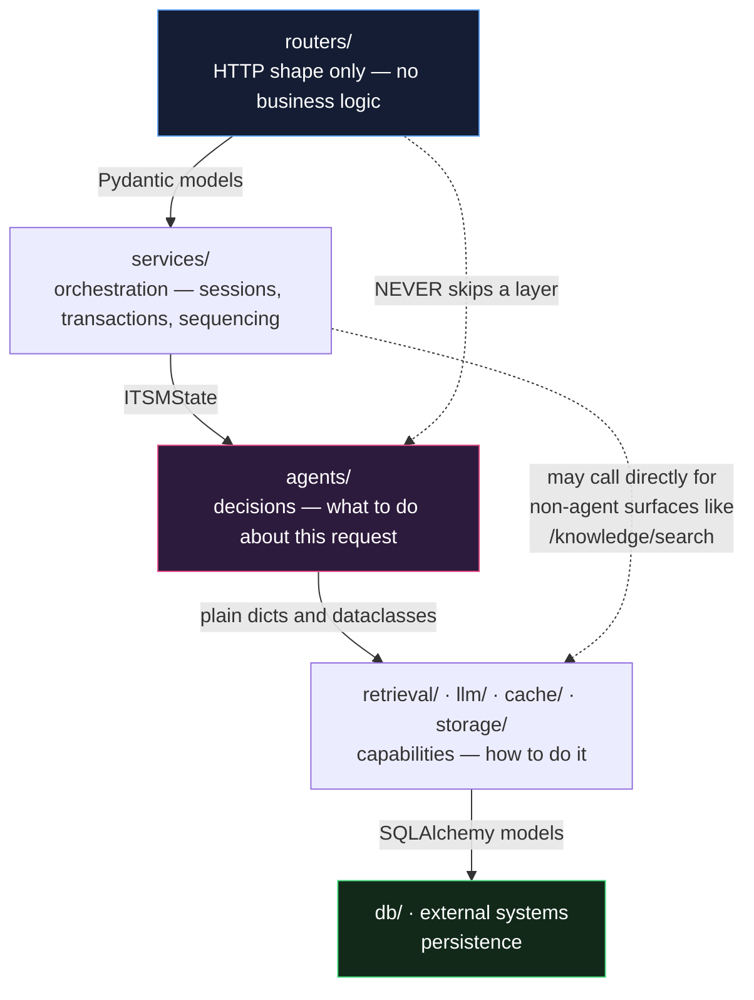
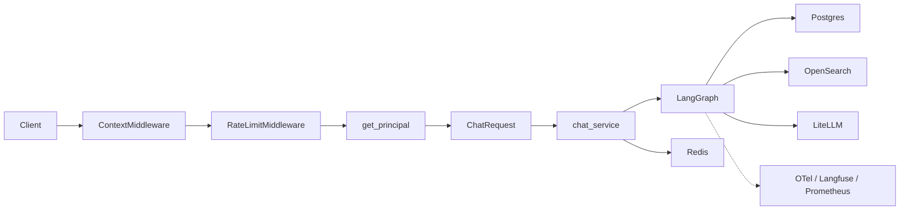
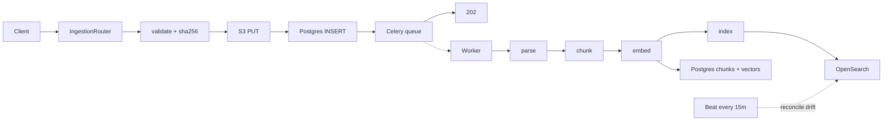
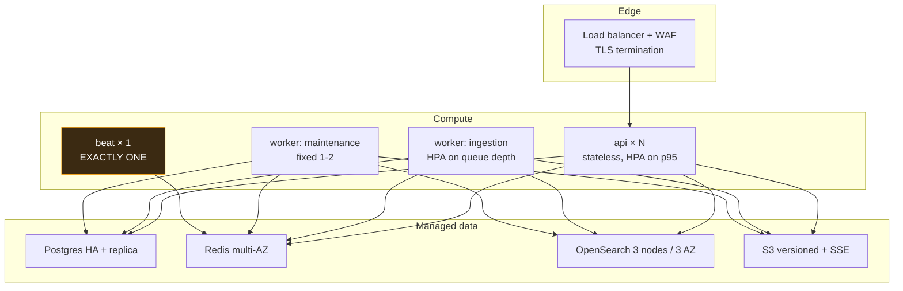
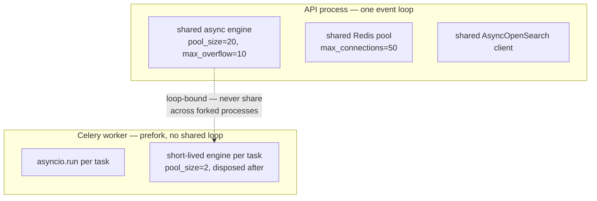

# Architecture

The layered view from the original design, the contracts between layers, and the
decisions behind them.

---

## The stack

```
START LOCAL       Python / notebook ──SDK──► LLM provider
                  prototype only — production never calls a provider SDK directly

SERVICE EDGE      Client ──► Uvicorn (ASGI) ──► FastAPI
   HTTP entry     6 routers · SSE · rate limit · request-id correlation

CONTRACTS         Pydantic v2
   in process     request validation • response serialization

AGENT CORE        LangGraph
   stateful       workflow • shared state • checkpoints (AsyncPostgresSaver)

DURABLE DATA      Postgres 16 + pgvector
   system of      tickets • documents • chunks • vectors • checkpoints • audit
   record

VECTOR SEARCH     OpenSearch 2.17
   retrieval      BM25 + kNN in one index • RRF fusion • ACL / CI filters

OBJECT STORE      S3 / MinIO
   raw bytes      SSE-AES256 • presigned reads • content-addressed keys

FAST STATE        Redis 7
   cache w/ TTL   cache • rate limit • idempotency • budget • session history

MODEL ACCESS      LiteLLM  ──► OpenAI | Anthropic | Azure | other
   governed       routing • fallbacks • retries • budgets • cost accounting

ASYNC WORK        Celery + beat
   queues         ingestion • maintenance

OBSERVABILITY     OpenTelemetry · Langfuse · Prometheus
   out of band    traces • spans • usage • latency • errors • ITSM KPIs

QUALITY / CI      Pytest · Ruff · mypy · Alembic · golden-set eval
   offline gate
```

---

## Layer contracts

Each layer only knows about the one below it. That is what keeps the thing
replaceable.



Practical consequences you can check in review:

- A router never imports from `retrieval/` or `llm/`. If it does, logic has
  leaked upward.
- An agent node never touches `Request`, `Principal` or a database session
  directly — everything it needs is in `ITSMState`. That is what makes nodes
  checkpointable and replayable.
- `llm/client.py` is the only module that imports `litellm`. Grep for it.
- `services/` owns the transaction boundary. Nodes get their own short-lived
  sessions via `session_scope()`.

---

## Request flow — chat



Detailed sequence: [`sequence-flows.md` §1](sequence-flows.md).

## Request flow — ingestion



Detailed sequence: [`sequence-flows.md` §5](sequence-flows.md).

---

## Data ownership

| Data | Owner | Derived copy | Rebuild cost |
|---|---|---|---|
| Raw file bytes | S3 | — | irreplaceable |
| Document + chunk metadata | Postgres | OpenSearch `_source` | minutes |
| Chunk embeddings | Postgres (pgvector) | OpenSearch `knn_vector` | minutes, no re-embed |
| Tickets and events | Postgres | — | backup/restore |
| Conversation state | Postgres checkpoints | Redis history cache | cache is disposable |
| Spend and rate counters | Redis | Prometheus | resets by design |

**Postgres is authoritative for everything except the raw bytes.** OpenSearch
and Redis are rebuildable from it, and the 15-minute reconciliation job proves
that continuously — which is far better than a restore procedure you only
exercise during a disaster.

---

## Deployment topology



Two rules that will bite you if ignored:

1. **Beat is a singleton.** Two schedulers means every periodic job runs twice —
   including problem clustering, which then bills you twice for the same LLM work.
2. **`api` and `worker` are the same image, different command.** That guarantees
   the worker has the same parsers, prompts and schema as the API that queued
   the job. Never build them separately.

---

## Concurrency model



This is `app/workers/runtime.py`, and the comment in it is the reason:
SQLAlchemy async engines bind to the event loop that created them. Sharing the
API's engine into a forked Celery worker produces intermittent "attached to a
different loop" errors that only appear under load. A short-lived engine per
task costs a little connection churn and eliminates the entire failure class.

---

## Architecture decision records

| # | Decision | Alternatives considered | Why this one |
|---|---|---|---|
| 1 | **LangGraph for the agent core** | Bare function chain; LangChain AgentExecutor; a custom state machine | Checkpointing and `interrupt_before` are the requirements. A bare chain cannot suspend for a human approval and resume hours later. |
| 2 | **Deterministic routing, not an LLM router** | Model picks the next action; tool-calling loop | An LLM deciding whether to escalate a P1 is a non-reproducible control. A function is testable and passes change review. |
| 3 | **Confidence blends retrieval score** | Model self-report alone; fixed threshold on rerank score | Models over-report confidence. Blending the top rerank score stops a fluent answer over weak passages from auto-resolving. |
| 4 | **RRF for hybrid fusion** | Weighted score blend; OpenSearch `hybrid` search pipeline | BM25 is unbounded, cosine is `[0,1]`. Tuned weights rot when the corpus changes. Rank position is stable. |
| 5 | **Both pgvector and OpenSearch** | OpenSearch only; pgvector only | pgvector gives read-after-write consistency, ticket similarity inside the transactional DB, and a degraded-mode path. OpenSearch gives hybrid at scale. |
| 6 | **LiteLLM as the sole model path** | Provider SDKs directly; LangChain chat models | One place to add fallbacks, cap spend, swap models and account for cost. This is what makes the governed path enforceable rather than aspirational. |
| 7 | **Celery over FastAPI BackgroundTasks** | `BackgroundTasks`; arq; Temporal | Ingestion needs retries, a dead-letter state, a scheduler and horizontal workers. `BackgroundTasks` dies with the process. |
| 8 | **Deterministic chunk ids (`uuid5`)** | Random UUID; auto-increment | Makes retries idempotent, keeps citations stable across reprocessing, and allows single-document re-embedding. |
| 9 | **Heading-aware chunking** | Fixed-size window; semantic chunking | Runbooks are numbered procedures. Cutting "step 3 of 5" in half produces confidently wrong answers. Semantic chunking costs an LLM call per document for a marginal gain here. |
| 10 | **HNSW over IVFFlat in pgvector** | IVFFlat; no index | No training step, and recall stays stable as the KB grows article by article — which is how a real KB grows. |
| 11 | **Guardrails: regex closed, model open** | Both closed; both open | Injection is cheap and deterministic to detect. Content judgement is not, and a dead service desk is worse than one rude message. |
| 12 | **Allow-list for automations** | Block-list of dangerous actions | A block-list is a list you keep extending after incidents. An allow-list of six reversible operations is one you extend deliberately. |
| 13 | **Prompts in one module** | Inline f-strings; a prompt-management SaaS | Prompts are behaviour. They belong in code review, diffs and the eval loop. |
| 14 | **Ticket intake needs no model call** | Agent must classify before a ticket exists | So intake survives a total provider outage. The model makes tickets better, never possible. |
| 15 | **Streaming graph events, not tokens** | Token streaming | For a service desk the useful signal is "searching the knowledge base", not a token trickle. Also lets a node change the plan mid-run. |

---

## What is deliberately not here

Honest scoping, so nobody is surprised in review.

| Not included | Why | Where the seam is |
|---|---|---|
| ServiceNow / Jira bi-directional sync | Every estate's field mapping differs | `Ticket.external_ref` + the idempotency layer |
| Real automation execution | Your orchestrator, your credentials | `itsm_tools.run_safe_automation` |
| CMDB integration | Schema varies wildly | `Ticket.ci_name`, `filters.ci_name` |
| A front-end | The API is the product here | OpenAPI at `/docs`, SSE at `/chat/stream` |
| Cross-encoder reranking | Needs a model server or a paid API | `pipeline.rerank` isolates the interface |
| Multi-modal ingestion | Docling returns figure refs; storing and citing them is a design choice | `parsers.parse` returns `(markdown, metadata)` |
| PII redaction on ingested documents | Redaction runs on messages, not documents | Add a step in `parsers.parse` |
| Checkpoint retention job | Depends on your retention policy | SQL provided in `data-model.md` |
