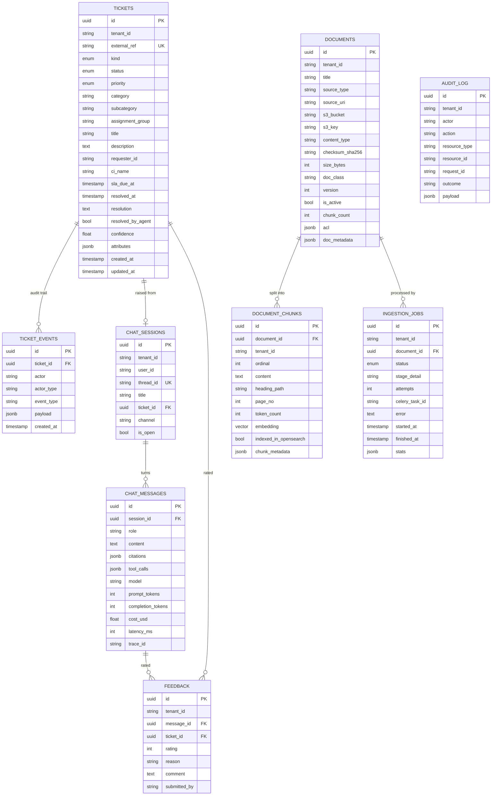
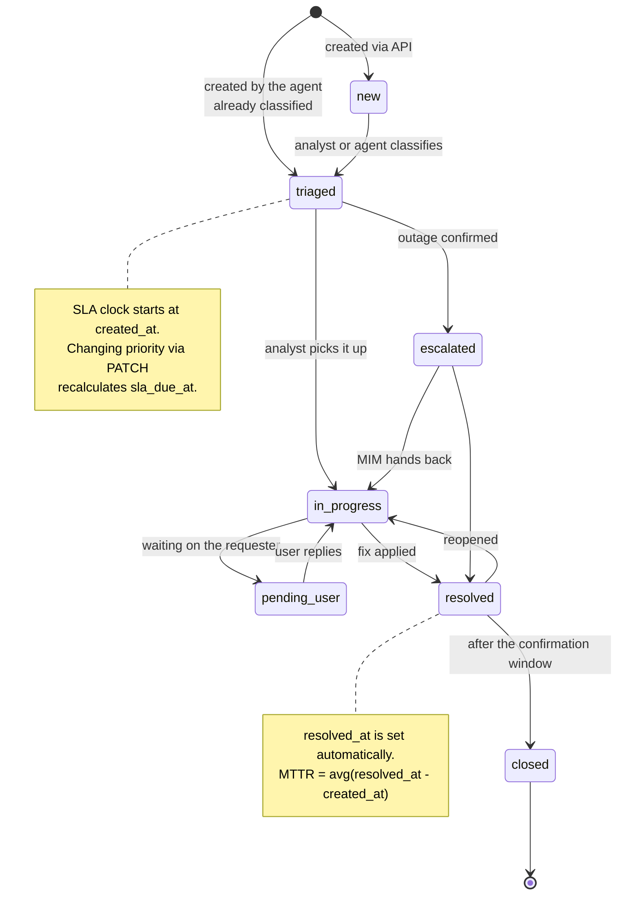
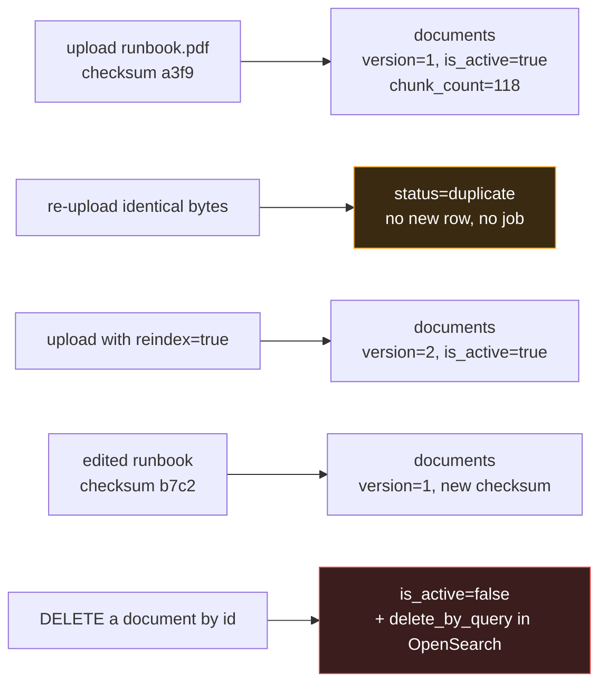
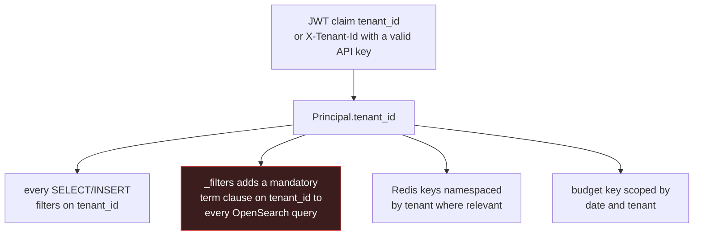

# Data model

Nine tables plus LangGraph's own checkpoint tables. Postgres is authoritative
for everything except raw bytes.

---

## Full ER diagram



`AUDIT_LOG` has no foreign keys on purpose. It must survive the deletion of
whatever it describes.

---

## Ticket lifecycle



### SLA matrix

| Priority | Definition | SLA hours (`SLA_HOURS`) |
|---|---|---|
| P1 | Business-wide outage, revenue impact, no workaround | 4 |
| P2 | Multiple users or a critical single user blocked | 8 |
| P3 | Single user impaired, workaround exists | 24 |
| P4 | Informational, cosmetic, scheduled request | 72 |

`GET /tickets/sla/at-risk?within_minutes=60` returns anything due inside the
window that is not resolved or closed.

---

## Document versioning



Deletion is soft in Postgres and hard in OpenSearch. You keep the audit trail
and the S3 object; the content stops being retrievable immediately.

---

## Chunk identity

```
chunk_id = uuid5(NAMESPACE_URL, f"{document_id}:{ordinal}")
```

This one line gives you three properties:

1. **Idempotent retries.** Re-running a failed ingestion overwrites the same
   rows and the same OpenSearch documents. No duplicates, ever.
2. **Stable citations.** A `chunk_id` in a six-month-old `audit_log` row still
   points at the same passage, so you can reconstruct what the agent actually
   read when it made a decision.
3. **Safe partial reprocessing.** You can re-embed a single document without
   touching anything else in the index.

---

## LangGraph checkpoint tables

`AsyncPostgresSaver.setup()` creates these on first boot. You do not manage them
in Alembic — the library owns their schema.

| Table | Purpose |
|---|---|
| `checkpoints` | Serialized state per `(thread_id, checkpoint_id)` |
| `checkpoint_blobs` | Large state values stored out of line |
| `checkpoint_writes` | Pending writes for interrupted runs |
| `checkpoint_migrations` | The library's own version tracking |

The `thread_id` is `chat_sessions.thread_id`. That is the join between your
domain data and the agent's runtime state — a `th_9f2c...` in a checkpoint row
and in a chat session are the same conversation.

**Retention.** Checkpoints grow with conversation volume. Add a monthly job:

```sql
DELETE FROM checkpoints
WHERE thread_id IN (
  SELECT thread_id FROM chat_sessions
  WHERE is_open = false AND updated_at < now() - interval '90 days'
);
```

---

## Query patterns and their indexes

| Query | Index used |
|---|---|
| Analyst queue: tenant + status + recency | `ix_tickets_tenant_status_created` |
| SLA at-risk sweep | `ix_tickets_priority` + `sla_due_at` scan |
| Ingestion dedupe | `ix_documents_checksum_sha256` + unique constraint |
| Document list by class | `ix_documents_tenant_active_class` |
| pgvector similarity | `ix_chunks_embedding_hnsw` |
| Degraded-mode fuzzy text | `ix_chunks_content_trgm` |
| Reconciliation sweep | `ix_document_chunks_indexed_in_opensearch` |
| Conversation transcript | `ix_chat_messages_session_id` |
| Audit by action | `ix_audit_log_action` + `ix_audit_log_created_at` |

---

## Multi-tenancy

`tenant_id` is a column on every table that holds user data, and it comes from
the authenticated `Principal` — never from a request body.



If you need harder isolation than row-level filtering — a regulated tenant, a
data-residency boundary — the clean seams are: a separate OpenSearch index per
tenant (change `settings.opensearch_index` to a per-tenant function), a separate
S3 prefix (already the case), and Postgres row-level security policies on
`tenant_id`.
