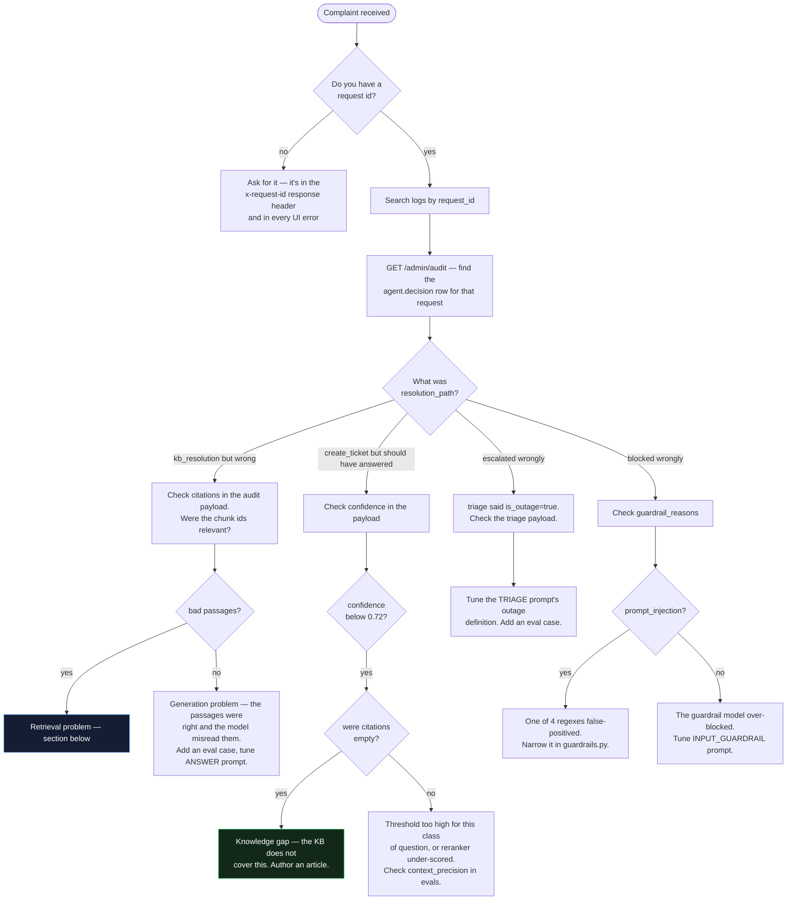
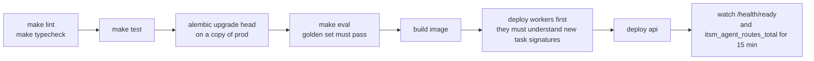

# Operations runbook

For whoever is on call.

---

## Health checks

| Endpoint | Meaning | Use for |
|---|---|---|
| `GET /health/live` | Process is up | Kubernetes liveness probe |
| `GET /health/ready` | Postgres + Redis + OpenSearch all reachable. 503 when any is not | Readiness probe, load balancer |
| `GET /metrics` | Prometheus | Scrape target |

```bash
curl -s localhost:8000/health/ready | jq
{
  "status": "ready",
  "checks": {
    "postgres":   {"ok": true},
    "redis":      {"ok": true},
    "opensearch": {"ok": true, "status": "green", "reachable": true}
  }
}
```

---

## Triage flowchart — "the agent is behaving badly"



Every branch ends with **add an eval case**. That is not a formality — it is the
only thing that stops the same failure recurring after the next prompt change.

---

## Retrieval is returning bad passages

```bash
# 1. Reproduce with the raw search endpoint — no agent, no generation
curl -s localhost:8000/api/v1/knowledge/search \
  -H 'X-API-Key: local-dev-key' -H 'Content-Type: application/json' \
  -d '{"query":"vpn error 812","top_k":10,"strategy":"hybrid","rerank":true}' | jq

# 2. Isolate the signal — which lane found it?
#    Compare bm25_score vs vector_score in the response.
#    strategy: "keyword" → BM25 only
#    strategy: "vector"  → kNN only
#    strategy: "pgvector"→ Postgres, bypasses OpenSearch entirely

# 3. Is the content even indexed?
curl -s localhost:9200/itsm-knowledge-v1/_count
curl -s localhost:8000/api/v1/ingestion/documents -H 'X-API-Key: local-dev-key' | jq '.total'

# 4. Compare — a mismatch means drift
psql -c "SELECT count(*) FROM document_chunks WHERE indexed_in_opensearch = false;"
```

| Symptom | Likely cause | Fix |
|---|---|---|
| Keyword works, vector does not | Embedding model changed, or dimension mismatch | Reindex; check `EMBEDDING_DIM` matches the model |
| Vector works, keyword does not | Analyzer or synonyms missing the term | Add to `ITSM_SYNONYMS`, update index settings |
| Both find it, reranker drops it | Rerank threshold of 3 too aggressive for this content | Inspect `rerank_score` in the response |
| Nothing found at all | ACL or CI filter excluding it | Check `documents.acl` and the filter in `_filters()` |
| Postgres count >> OpenSearch count | Drift from a failed bulk index | Wait 15 min for the beat job, or trigger it manually |

Force reconciliation:

```bash
docker compose exec worker python -c \
  "from app.workers.tasks.maintenance import reindex_stale_chunks; print(reindex_stale_chunks())"
```

---

## Ingestion jobs are stuck

```bash
# what state is everything in
curl -s localhost:8000/api/v1/ingestion/jobs -H 'X-API-Key: local-dev-key' \
  | jq '.items | group_by(.status) | map({status: .[0].status, count: length})'

# the failures, with their errors
curl -s "localhost:8000/api/v1/ingestion/jobs?status=dead_letter" -H 'X-API-Key: local-dev-key' \
  | jq '.items[] | {id, error, attempts, stage_detail}'

# queue depth and worker liveness
curl -s localhost:8000/api/v1/admin/queue -H 'X-API-Key: local-dev-key'
open http://localhost:5555     # Flower

# retry one
curl -X POST localhost:8000/api/v1/ingestion/jobs/{id}/retry -H 'X-API-Key: local-dev-key'
```

| Status stuck at | Meaning | Action |
|---|---|---|
| `queued` | Broker has it, no worker consuming | Check the worker is running and on the `ingestion` queue |
| `parsing` | Docling on a large or malformed PDF | Wait; sweeps to `dead_letter` after 2h |
| `embedding` | Provider slow or rate-limited | Check `itsm_llm_calls_total{outcome="error"}` |
| `indexing` | OpenSearch rejecting writes | Check cluster health and disk watermark |
| `dead_letter` | 3 failures or the 2h sweep | Read `error`, fix, then retry |

---

## Model costs are running away

```bash
curl -s localhost:8000/api/v1/admin/budget -H 'X-API-Key: local-dev-key'
```

```promql
# spend by purpose — usually reveals the culprit immediately
sum by (purpose) (rate(itsm_llm_calls_total[1h]))

# spend by tenant
sum by (tenant) (increase(itsm_llm_cost_usd_total[24h]))
```

The usual suspects, in order:

1. **Reranking.** One call per retrieval with 20 passages in the prompt. Cheapest
   fix: lower `RETRIEVAL_TOP_K`, or move to a cross-encoder.
2. **Compression.** One call *per passage*, in parallel. It only triggers for
   questions over 400 characters — check whether something is sending long
   payloads.
3. **Query rewrite.** Cached 10 minutes in Redis. A low hit rate means highly
   varied queries, which is normal, or a cache problem, which is not.
4. **A retry storm.** `itsm_llm_calls_total{outcome="error"}` climbing means
   you are paying for failed calls plus their retries.

Immediate lever: lower `DAILY_BUDGET_USD`. Requests return 402 before any model
call is made, which stops the bleeding without a deploy.

---

## Latency is high

Read the trace waterfall first — do not guess.

| p50 stage | Normal | Investigate above |
|---|---|---|
| `input_guardrail` | 300 ms | 800 ms |
| `triage` | 700 ms | 1.5 s |
| `retrieve` | 1.3 s | 3 s |
| `draft_answer` | 1.2 s | 3 s |
| `check_resolution` | 430 ms | 1 s |
| **total** | **3.5–4.5 s** | **10 s** |

```promql
histogram_quantile(0.95, sum by (le, node) (rate(itsm_agent_node_seconds_bucket[5m])))
```

Levers in order of impact:

1. Cross-encoder reranker instead of LLM rerank — removes ~600 ms and one call.
2. Lower `RERANK_TOP_N` from 6 to 4 — shorter answer prompt.
3. Skip `query_rewrite` for short questions.
4. A faster `PRIMARY_MODEL` for `triage` and `check_resolution` specifically —
   `llm.complete()` already takes a per-call `model` override.

---

## Deploy checklist



**Workers before API.** The API queues tasks the workers must be able to run. If
you deploy the API first with a changed task signature, every ingestion queued
in the gap dead-letters.

**Migrations must be backwards-compatible** for the duration of a rolling
deploy. Add columns nullable, backfill, then make them non-null in a later
release.

---

## Backup and restore

| What | How | RPO target |
|---|---|---|
| Postgres | Managed automated backups + PITR | 5 min |
| S3 | Versioning + cross-region replication | near-zero |
| OpenSearch | **Do not back up.** Rebuild from Postgres | n/a |
| Redis | AOF for convenience; all contents are disposable | n/a |

Rebuilding the search index from scratch:

```sql
UPDATE document_chunks SET indexed_in_opensearch = false;
```

Then delete the OpenSearch index and let the 15-minute reconciliation job refill
it, 500 chunks at a time. That is the same mechanism that handles routine drift,
which means **it is continuously tested in production** — unlike a restore
procedure you only run during a disaster.

---

## Common commands

```bash
make up            # full stack
make logs          # tail api + worker
make seed          # sample data
make smoke         # end-to-end verification
make eval          # golden set
make test          # unit tests
make migrate       # alembic upgrade head
make revision m="add x"

docker compose exec api python -c "from app.core.config import settings; print(settings.model_dump())"
docker compose exec worker celery -A app.workers.celery_app.celery_app inspect active
docker compose exec postgres psql -U itsm -c "SELECT status, count(*) FROM ingestion_jobs GROUP BY 1;"
curl -s localhost:9200/_cat/indices?v
```
