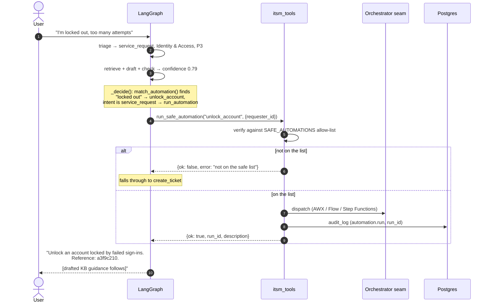
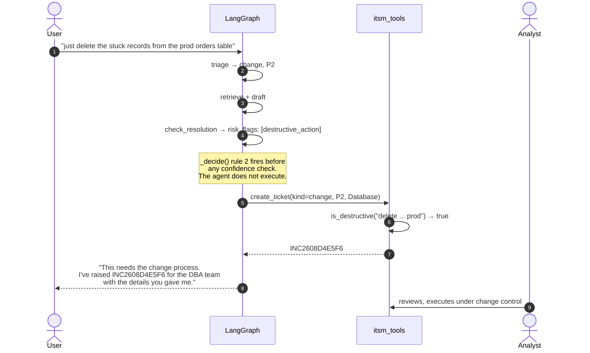
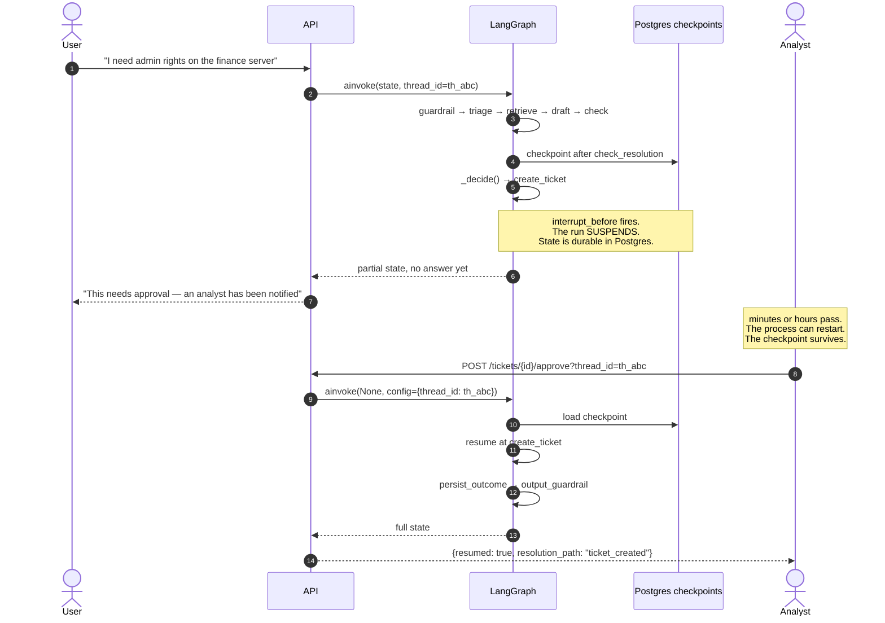
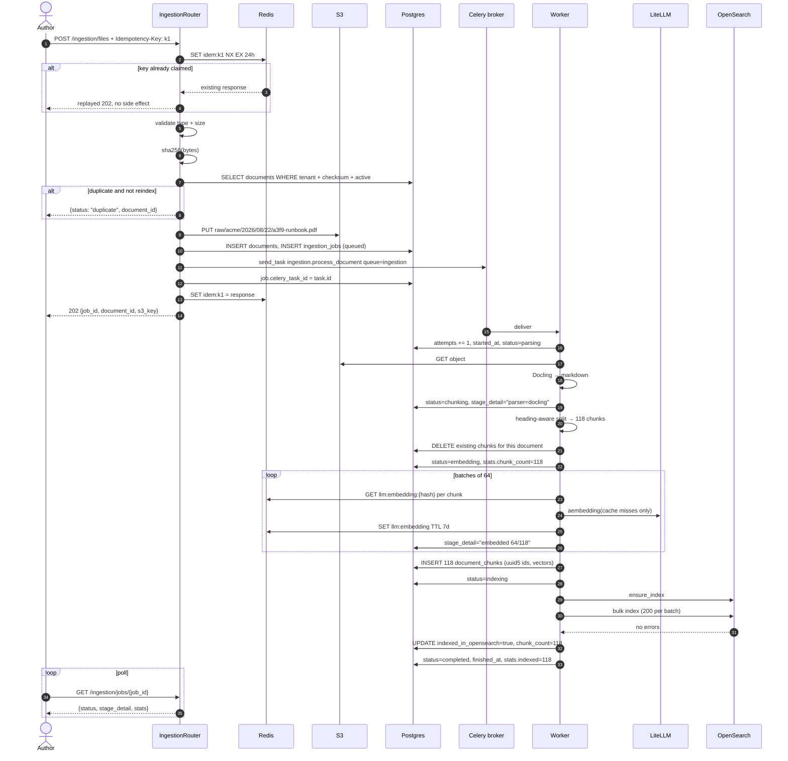
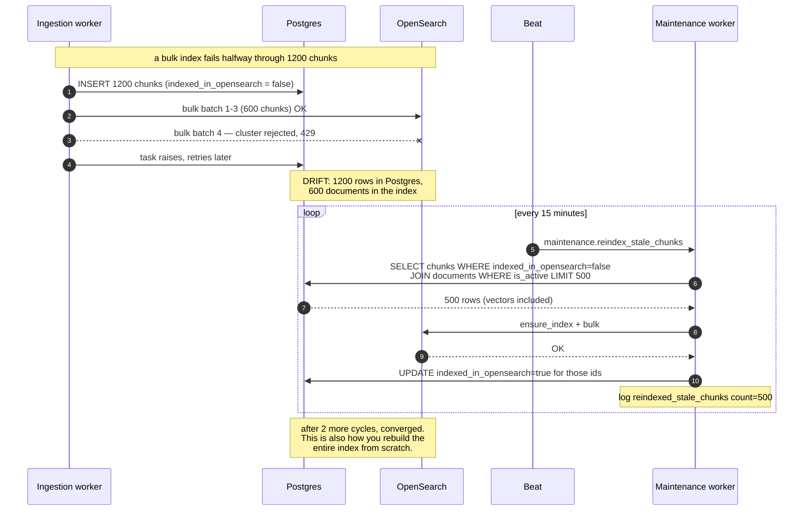
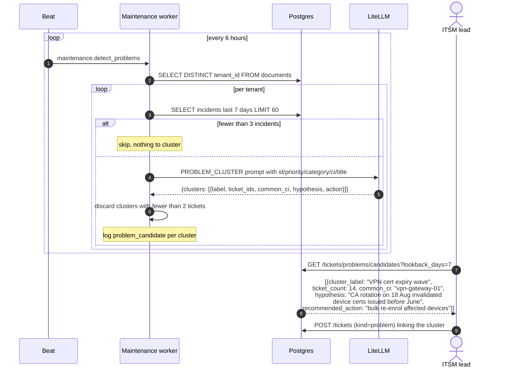
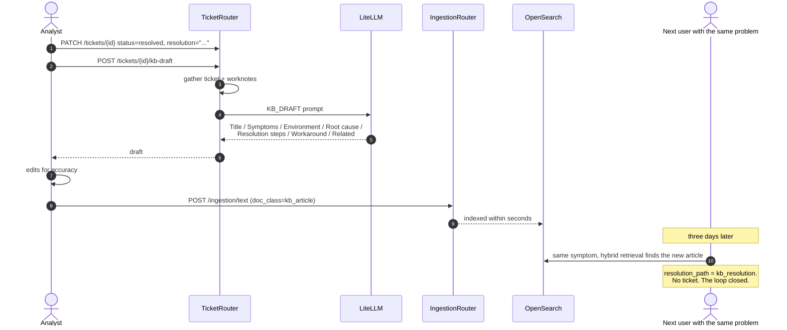
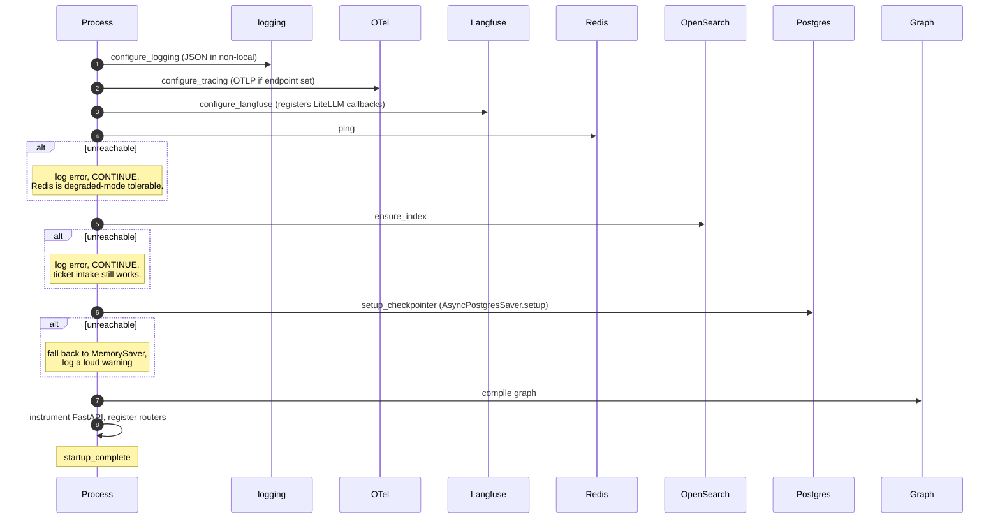

# Sequence flows

Every significant path through the system, as a sequence diagram. These are the
diagrams to put in front of an architecture review board.

---

## 1. Chat — full detail, KB resolution

```mermaid
sequenceDiagram
    autonumber
    actor U as User
    participant MW as Middleware
    participant SEC as security.get_principal
    participant CR as ChatRouter
    participant CS as chat_service
    participant RD as Redis
    participant PG as Postgres
    participant G as LangGraph
    participant LL as LiteLLM
    participant OS as OpenSearch

    U->>MW: POST /api/v1/chat
    MW->>MW: set request_id, tenant_id, trace_id contextvars
    MW->>RD: INCR ratelimit:{tenant}:{ip} EX 60
    RD-->>MW: 12 of 60
    MW->>SEC: resolve credentials
    SEC-->>MW: Principal(tenant=acme, roles=[user])
    MW->>CR: validated ChatRequest

    CR->>CS: handle_turn(session, principal, req)
    CS->>PG: SELECT chat_sessions WHERE thread_id
    alt new conversation
        CS->>PG: INSERT chat_sessions (thread_id = th_xxx)
    end
    CS->>RD: GET chat:history:{thread_id}
    alt cache miss
        CS->>PG: SELECT last 10 chat_messages
        CS->>RD: SET chat:history TTL 1h
    end
    CS->>PG: INSERT chat_messages (role=user)
    CS->>G: ainvoke(state, config={thread_id})

    rect rgb(45,20,22)
        Note over G,LL: input_guardrail
        G->>G: 4 injection regexes, secret redaction
        G->>LL: guardrail model pass (message > 40 chars)
        LL-->>G: {allow: true, reasons: [], redacted_message}
        G->>PG: checkpoint
    end

    rect rgb(45,27,61)
        Note over G,LL: triage
        G->>PG: recent resolved tickets for context
        G->>LL: TRIAGE prompt, response_format=json_object
        LL-->>G: {intent, category, priority, ci, is_outage, confidence}
        G->>G: force P2 if is_outage and priority in (P3,P4)
        G->>PG: checkpoint
    end

    rect rgb(20,29,51)
        Note over G,OS: retrieve
        G->>RD: GET retrieval:query:rw:{hash}
        alt cache miss
            G->>LL: QUERY_REWRITE → 3 variants
            G->>RD: SET TTL 10m
        end
        par BM25 lane
            G->>OS: multi_match x3 (filter: tenant, acl, active, ci)
        and vector lane
            G->>LL: aembedding(3 queries)
            G->>OS: knn x3 (same filters)
        end
        OS-->>G: 6 rankings, 74 candidates
        G->>G: reciprocal_rank_fusion → 30
        G->>LL: RERANK prompt, scores 0-10
        LL-->>G: keep 6 above threshold 3
        G->>G: build citations [1]..[6]
        G->>PG: checkpoint
    end

    rect rgb(18,41,26)
        Note over G,LL: draft_answer + check_resolution
        G->>LL: ANSWER prompt with 6 numbered passages
        LL-->>G: grounded answer with [n] markers
        G->>LL: RESOLUTION_CHECK
        LL-->>G: {resolves: true, confidence: 0.88, risk_flags: []}
        G->>G: 0.6*0.88 + 0.4*(8.5/10) = 0.87
        G->>PG: checkpoint
    end

    G->>G: _decide() → finalize_kb_answer
    G->>PG: INSERT audit_log (agent.decision)
    G->>G: output_guardrail — redact, flag ungrounded
    G-->>CS: final state

    CS->>PG: INSERT chat_messages (role=assistant, usage, citations, trace_id)
    CS->>RD: DEL chat:history:{thread_id}
    CS-->>CR: ChatResponse
    CR-->>MW: 200
    MW->>MW: Prometheus REQUESTS + LATENCY
    MW-->>U: 200 + x-request-id, x-response-time-ms
```

---

## 2. Chat — automation path

The allow-list is the whole control. `SAFE_AUTOMATIONS` is six reversible,
idempotent operations. Anything not on it becomes a ticket — never an improvised
action.

---

## 3. Chat — destructive request, proposal not execution

`DESTRUCTIVE_KEYWORDS` covers delete, drop, truncate, `rm -rf`, revoke, disable
account, restart production, failover, wipe. Extend it for your estate.

---

## 4. Human-in-the-loop with checkpoint suspension

Enable by uncommenting `interrupt_before=["create_ticket"]` in `graph.py`.

This is why checkpointing is not optional plumbing. It is what makes graduated
autonomy possible: approve everything at first, then narrow the gate as your
eval numbers earn it.

---

## 5. Ingestion — happy path with progress polling

---

## 6. Ingestion — failure, retry, dead letter, recovery

```mermaid
sequenceDiagram
    autonumber
    participant BR as Broker
    participant WK as Worker
    participant PG as Postgres
    participant LL as LiteLLM
    participant B as Beat
    actor P as Platform engineer

    BR->>WK: process_document (attempt 1)
    WK->>PG: status=embedding
    WK->>LL: aembedding batch
    LL--xWK: provider 503
    WK->>WK: autoretry_for=(Exception,) backoff 10s
    Note over WK: attempts=1, task requeued

    BR->>WK: attempt 2 (after 10s)
    LL--xWK: provider 503 again
    Note over WK: backoff 20s, attempts=2

    BR->>WK: attempt 3 (after 20s)
    LL--xWK: still failing
    WK->>PG: attempts >= max_retries<br/>status=dead_letter, error recorded
    Note over WK: itsm_ingest_documents_total{status="failed"}++

    rect rgb(45,42,18)
        Note over B,PG: separately — a worker that DIED mid-task
        B->>PG: maintenance.expire_stuck_jobs (every 30m)
        PG->>PG: UPDATE jobs SET dead_letter<br/>WHERE in-flight AND updated_at < now()-2h
    end

    P->>PG: GET /ingestion/jobs?status=dead_letter
    P->>BR: POST /ingestion/jobs/{id}/retry
    BR->>WK: process_document (fresh)
    Note over WK: chunk ids are uuid5(doc:ordinal)<br/>so this overwrites cleanly.<br/>No duplicates, ever.
    WK->>PG: status=completed
```

---

## 7. Reconciliation — Postgres and OpenSearch drift

---

## 8. Problem management — scheduled incident clustering

Fourteen individual P3 incidents nobody connected become one problem record with
a hypothesis and a next action. That is the practice most ITSM teams do worst
and where AI genuinely helps.

---

## 9. Continuous improvement — the closing loop

---

## 10. Boot sequence

The service starts even when Redis and OpenSearch are down. It logs loudly,
`/health/ready` returns 503 so the load balancer holds traffic back, but the
process is up and will self-heal when the dependency returns. Only Postgres is
hard-required, and even then the checkpointer degrades to memory rather than
crash-looping.
